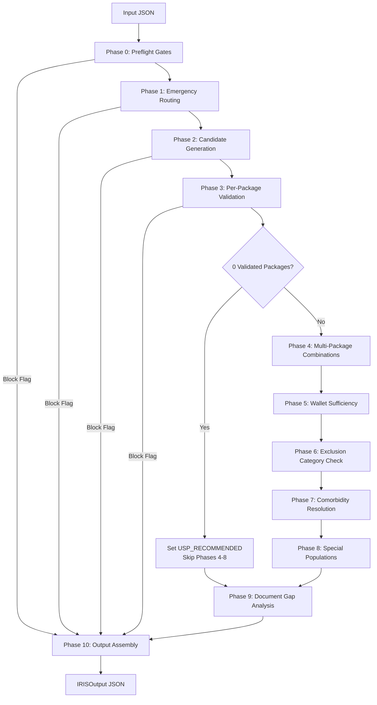

# IRIS Pre-Authorisation Engine (Phase 1)

IRIS is a deterministic, multi-phase decision engine for India's national health assurance scheme (**PM-JAY**). Given patient clinical information at admission, IRIS recommends valid PM-JAY package codes, runs clinical guidelines checks, calculates multi-package billing rates, identifies document gaps, and assesses pre-auth readiness.

---

## System Overview & Data Flow

IRIS runs as a **deterministic pipeline of sequential phases**. Each phase is a function that reads from and mutates a shared state container (`IRISSession`).



### Early Exit Safeguards
- **Blocking Flags:** After each of the first four phases (Phases 0–3), the orchestrator checks `session.has_block_flag()`. If any flag has `severity="block"`, the engine immediately skips to Phase 10 to assemble the final blocked output.
- **Unspecified Surgical Package (USP) Pathway:** If Phase 3 results in zero validated packages, the engine sets `session.usp_recommended = True`, skips Phases 4–8, and jumps directly to Phase 9 and 10.

---

## Directory Structure

```
1hat-phase1/
├── main.py                    # CLI Entry Point & Pipeline Orchestration
├── config.py                  # Global Constants & Configuration (Tunable Parameters)
├── session.py                 # Shared Pipeline State Container (IRISSession)
├── models.py                  # Domain Dataclasses (Type-hinted, No Pydantic)
├── input_validator.py         # JSON Schema Validator (Stubbed for MVP)
├── logger_setup.py            # Global Logger Configuration
│
├── kb/                        # Knowledge Base I/O & Search Layers
│   ├── loader.py              # LRU-cached JSON File Loaders
│   └── searcher.py            # Fuzzy Candidate Search (rapidfuzz)
│
├── llm/                       # LLM Gateway
│   └── stg_checker.py         # Gemini API Client for STG Clinical Checks
│
├── stubs/                     # External Government Database Stubs
│   ├── bis_stub.py            # Beneficiary Identification System (Patient Context)
│   └── hem_stub.py            # Hospital Empanelment Module (Hospital Context)
│
├── phases/                    # Deterministic Pipeline Phases (Phases 0 - 10)
│   ├── phase0_preflight.py    # Patient & Hospital Pre-admission Gates
│   ├── phase1_emergency.py    # Emergency Admission Routing (Stubbed for MVP)
│   ├── phase2_candidates.py   # Clinical-based Candidate Selection
│   ├── phase3_validator.py    # Rule Verification & LLM STG Eligibility
│   ├── phase4_multipackage.py # Combination Rules, Deductions, and Standalones
│   ├── phase5_financial.py    # Base-rate Estimate & Wallet Sufficiency Check
│   ├── phase6_exclusion.py    # Annexure 6 Exclusions (OPD, Cosmetic, etc.)
│   ├── phase7_comorbidity.py  # Comorbidity Absorption Rules
│   ├── phase8_special_pop.py  # Neonatal, Paediatric, Portability, and MTB routing
│   ├── phase9_documents.py    # Annexure 7 Relaxation & Document Gap Analysis
│   └── phase10_output.py      # Final Assembly & Readiness State Resolution
│
├── data/                      # Knowledge Base JSON Files
│   ├── hbp/                   # Health Benefit Package Shards & Thin Index
│   ├── stg/                   # Standard Treatment Guidelines per Procedure
│   └── schemes/               # PM-JAY Scheme-specific configurations
│
└── tests/
    └── inputs/                # Standard JSON test inputs (TC01.json - TC15.json)
```

---

## Detailed Pipeline Phases

| Phase | Phase Name | Core Responsibility / Logic |
|---|---|---|
| **Phase 0** | **Preflight Gates** | Resolves patient metadata via BIS and hospital profile via HEM. Aborts if patient is not registered or the hospital's scheme is not `"pmjay"`. |
| **Phase 1** | **Emergency Routing** | Identifies emergency admissions based on vitals and symptoms. *(Stubbed in MVP — defaults to elective planned admission)*. |
| **Phase 2** | **Candidate Generation** | Formulates a search query from clinical inputs and runs a fuzzy text search against the `_index.json` HBP catalog. Filters out specialties the hospital is not empanelled for and restricted public-only packages (if private). |
| **Phase 3** | **Per-Package Validator** | Loads full procedure details from specialty JSON shards. Performs public-reservation checks, classifies billing types, runs the LLM STG eligibility check, resolves bed-category/procedural stratification, checks implant criteria, and estimates LoS enhancement counts. |
| **Phase 4** | **Multi-Package Rules** | Resolves package combinations: drops per-day packages if a surgical package is present; keeps only one per-day package; segregates standalones into group 2; checks add-on parents; and applies the **100-50-25%** surgical deduction scale. |
| **Phase 5** | **Financial Check** | Computes base-rate estimates. Validates against available wallet. Senior citizens (age ≥70) trigger Vay Vandana Yojana dual-wallet checks, flagging debit-order ambiguity. |
| **Phase 6** | **Exclusion Verification** | Scans clinical texts for keywords matching PM-JAY Annexure 6 exclusions (OPD-only, dental, cosmetic, etc.) and raises warning flags. |
| **Phase 7** | **Comorbidity Resolution** | Identifies standard chronic management conditions (e.g. Hypertension, Diabetes) and marks them as absorbed by the primary surgical package. |
| **Phase 8** | **Special Populations** | Adds flags for neonatal risk escalation, paediatric device warnings, interstate portability TAT adjustments, mandatory tumor boards (MTB) for oncology, and NOTTO donor/recipient IDs for transplants. |
| **Phase 9** | **Document Gap Analysis** | Compiles checklist of required documents: universal (`clinical_notes` and `patient_photo`), conditional (MLC reports, NOTTO IDs, MTB approvals), and package-specific guidelines. Waives all except `clinical_notes` for public hospitals. |
| **Phase 10**| **Output Assembly** | Assigns final pre-auth readiness status: **READY**, **READY_WITH_WARNINGS**, **CONDITIONAL**, or **BLOCKED**. Packages output into serializable JSON. |

---

## Environment Setup & Requirements

IRIS requires **Python 3.11+**.

### 1. Install Dependencies
```bash
pip install -r requirements.txt
```
*Dependencies:* `rapidfuzz` (fuzzy matching), `google-genai` (Gemini API client), `python-dotenv` (environment configuration).

### 2. Configure Environment Variables
Create a `.env` file in the project root:
```env
GEMINI_API_KEY=your_gemini_api_key_here
```

---

## How to Run the Pipeline

IRIS accepts a standard admission JSON input and outputs a structured pre-auth readiness report.

### Standard Execution (using CLI)
You can run the pipeline by specifying the path to an input JSON file:
```bash
python main.py tests/inputs/TC01.json
```

Or pipe the input via standard input (stdin):
```bash
# Windows PowerShell
cat tests/inputs/TC01.json | python main.py

# Bash / Linux / macOS
python main.py < tests/inputs/TC01.json
```

### Sample Output structure
```json
{
  "readiness_status": "READY_WITH_WARNINGS",
  "selected_packages": [ ... ],
  "blocked_candidates": [ ... ],
  "preauth_docs_required": [ ... ],
  "preauth_docs_missing": [ ... ],
  "enhancement_plan": [ ... ],
  "copayment_required": false,
  "copayment_gap_inr": null,
  "flags": [ ... ],
  "stg_coverage": {
    "validated": 2,
    "stg_missing": 0
  },
  "errors": []
}
```

---

## How to Run Tests

There are four smoke/unit test scripts in the root directory:

### 1. KB Loader Test (`phaseb_test.py`)
Validates that the HBP index, specialty shards, STG catalog, and database stubs (BIS/HEM) are loading correctly.
```bash
python phaseb_test.py
```

### 2. Early Pipeline Test (`phasec_test.py`)
Tests Phase 0 (Preflight) through Phase 2 (Candidate Generation). Useful to verify that clinical inputs are being fuzzily matched to candidate procedures.
```bash
python phasec_test.py
```

### 3. LLM STG Validation Test (`phased_test.py`)
Triggers the Phase 3 candidate validation and runs the LLM STG eligibility checks using the Gemini API.
```bash
python phased_test.py
```

### 4. Full Pipeline Test (`phasee_test.py`)
Simulates the entire pipeline execution (Phases 0 through 10) on a mock clinical input.
```bash
python phasee_test.py
```

> **Note on Windows Terminal Encoding:**
> If you run `phasee_test.py` directly on a Windows terminal with default CP1252 encoding, you might experience a `UnicodeEncodeError` when the test prints checkmark (`✓`) and cross (`✗`) characters to the console.
> You can bypass this print-only terminal encoding issue by redirecting the output, or by running:
> ```powershell
> [Console]::OutputEncoding = [System.Text.Encoding]::UTF8
> python phasee_test.py
> ```
