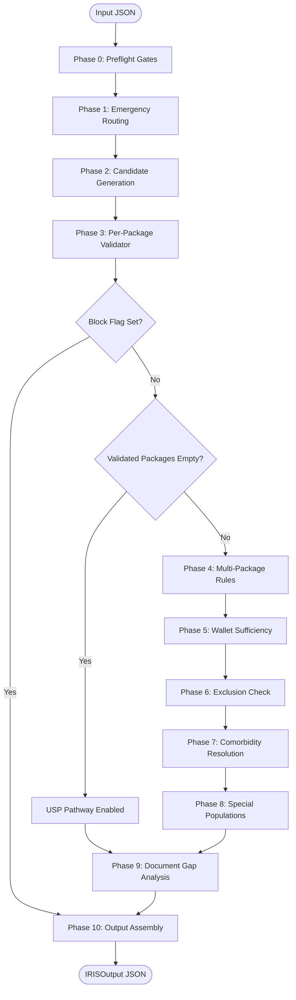

# IRIS System Design — PM-JAY Pre-Authorisation Engine

This document provides the authoritative system design and architecture of IRIS, a clinical pre-authorisation decision engine for India's national health assurance scheme (**PM-JAY**).

---

## 1. Pipeline Overview (Phases 0–10)

IRIS executes an 11-phase deterministic pipeline using a central mutable state object, `IRISSession`. The pipeline runs sequentially in `main.py` inside `run_pipeline()`.



### Detailed Phase Specifications

#### Phase 0: Preflight Gates (`phases/phase0_preflight.py`)
- **Reads:** `patient_id`, `hospital_id`, doctor's registration details, scheme type, and `is_medico_legal`.
- **Writes:** `session.patient` (PatientContext), `session.hospital` (HospitalContext), `session.patient_eligible`, `session.hospital_empanelled`, and `session.mlc_required`.
- **Logic:** Queries BIS and HEM stubs. Blocks if patient not found (`PATIENT_NOT_IN_BIS`), hospital scheme is unsupported (`SCHEME_NOT_SUPPORTED`), or stub queries throw errors (`PREFLIGHT_FAILED`).

#### Phase 1: Emergency Routing (`phases/phase1_emergency.py`)
- **Reads:** `clinical.is_emergency`, `planned_procedure`.
- **Writes:** `session.is_emergency`, `session.er_package_code`, and `session.needs_specialty_package`.
- **Logic:** Currently stubbed (always sets `is_emergency=False` and elective routing). Emits `EMERGENCY_PHASE_STUBBED` info flag.

#### Phase 2: Candidate Generation (`phases/phase2_candidates.py`)
- **Reads:** `ClinicalInput` (chief complaints, HPI, diagnosis), hospital empanelment specialties.
- **Writes:** `session.candidate_packages` (list of CandidatePackage).
- **Logic:** Delegates to `kb/searcher_router.py`. Searches candidates based on `config.PHASE2_SEARCH_MODE` (either local fuzzy match or Gemini LLM match). Filters out packages belonging to specialties the hospital is not empanelled for.

#### Phase 3: Per-Package Validator (`phases/phase3_validator.py`)
- **Reads:** `session.candidate_packages`, `HospitalContext`, `PatientContext`, `ClinicalInput`.
- **Writes:** `session.validated_packages` (list of ValidatedPackage), `session.phase3_blocked` (rejection reasons), and `session.stg_coverage` (statistics).
- **Logic:**
  1. Loads KB-2 specialty shard.
  2. Blocks private hospitals claiming public-reserved packages (`PUB_RESERVED_BLOCK`).
  3. Classifies billing type (`surgical`, `fixed_medical`, `per_day`, or `day_care`).
  4. Runs Gemini LLM Standard Treatment Guideline (STG) checks (KB-3) or LLM plausibility checks when STGs are missing.
  5. Resolves stratification and implant rules.
  6. Computes indicative length of stay (LoS) and enhancement requests.
  7. Resolves duplicate package entries (same `package_code` with multiple procedures) using a Gemini-powered stratum tiebreaker.

#### Phase 4: Multi-Package Rules (`phases/phase4_multipackage.py`)
- **Reads:** `session.validated_packages`.
- **Writes:** `session.final_package_set` (list of FinalPackage).
- **Logic:** Applies HBP multi-procedure combination rules:
  - Surgical + Medical (Per-Day): Drops medical per-day package in presence of surgical (`SURGICAL_PERDAY_BLOCKED`).
  - Multiple Medical (Per-Day): Drops lower-rate per-days when multiples exist (`PERDAY_MULTIPLE_BLOCKED`).
  - Standalone Package Splitting: Isolates standalones to separate pre-auth groups (`STANDALONE_SPLIT`).
  - Add-on Validation: Verifies parent packages exist, drops orphans (`ADDON_PARENT_MISSING`, `ADDON_PARENT_UNKNOWN`).
  - High-End Diagnostics: Drops diagnostic add-ons without an active per-day package (`DIAGNOSTIC_ADDON_BLOCKED`).
  - Deduction Factors: Applies descending rates (100% / 50% / 25%) to multiple surgical procedures.

#### Phase 5: Wallet Sufficiency (`phases/phase5_financial.py`)
- **Reads:** `session.final_package_set`, `PatientContext`.
- **Writes:** `session.estimated_total_inr`, `session.wallet_sufficient`, `session.copayment_required`, and `session.copayment_gap_inr`.
- **Logic:** Sums effective package rates. Handles senior citizens (age ≥70) possessing dual wallets (Family float + Vay Vandana card). Triggers warnings if debit order is ambiguous (`VAY_VANDANA_DEBIT_ORDER_AMBIGUOUS`) or if funds are insufficient (`WALLET_INSUFFICIENT`).

#### Phase 6: Exclusion Check (`phases/phase6_exclusion.py`)
- **Reads:** Clinical text (chief complaints, HPI, provisional diagnosis, notes).
- **Writes:** Exclusion warning flags (`EXCLUSION_*_RISK`).
- **Logic:** Keyword scans for PM-JAY Annexure 6 exclusions (OPD-only care, corrective dental, infertility/ART, routine vaccination, cosmetic surgery, circumcision under 2, persistent vegetative state, drug rehab).

#### Phase 7: Comorbidity Resolution (`phases/phase7_comorbidity.py`)
- **Reads:** Clinical comorbidities, `session.final_package_set`.
- **Writes:** `session.comorbidity_notes`, warning flags.
- **Logic:** Assesses clinical risk and adds review warnings (`COMORBIDITY_REVIEW_NEEDED`) if comorbidities require manual audit.

#### Phase 8: Special Populations (`phases/phase8_special_pop.py`)
- **Reads:** `PatientContext`, `HospitalContext`, `session.final_package_set`.
- **Writes:** Special demographic or clinical administrative flags.
- **Logic:** Sets warnings/info flags for neonates (age 0), paediatric devices (age ≤14), oncology Multidisciplinary Tumour Board (MTB) approvals, organ transplants (NOTTO docs), and interstate portability.

#### Phase 9: Document Gap Analysis (`phases/phase9_documents.py`)
- **Reads:** `session.final_package_set`, `HospitalContext`, `session.mlc_required`, `session.flags`.
- **Writes:** `session.preauth_docs_required` and `session.preauth_docs_missing` (lists of DocumentItem).
- **Logic:** Builds document checklist. Applies public hospital relaxation (requires only `clinical_notes`, waives others). Collects universal docs for private hospitals (`clinical_notes` + `patient_photo`), conditional docs (MLC, transplant, oncology, USP), and per-procedure KB-2 required docs.

#### Phase 10: Output Assembly (`phases/phase10_output.py`)
- **Reads:** All session variables.
- **Writes:** Formatted `IRISOutput` structure (does not mutate session).
- **Logic:** Classifies overall pre-auth readiness status (`READY`, `READY_WITH_WARNINGS`, `CONDITIONAL`, or `BLOCKED`) based on the highest-priority flag or document gap found.

---

### Pipeline Early-Exit & Jump Rules

1. **Block Early Exit:** Checked after Phase 0, Phase 1, Phase 2, and Phase 3. If `session.has_block_flag()` evaluates to `True`, the pipeline immediately stops processing and jumps directly to Phase 10 (Output Assembly), skipping all intermediate phases.
2. **Unspecified Surgical Package (USP) Jump:** Checked after Phase 3. If `session.validated_packages` is empty and no block flags exist, the engine enables the USP path:
   - Sets `session.usp_recommended = True`
   - Emits `USP_RECOMMENDED` warning flag
   - Skips Phases 4–8 entirely
   - Jumps directly to Phase 9 (Document Gap Analysis) and then Phase 10.

---

## 2. Complete File Structure

```
e:\Code\1hat-phase1/
├── app.py                       # Streamlit interactive testing/debug console
├── config.py                    # Static config thresholds, timeouts, and search routers
├── main.py                      # CLI entry point and pipeline sequencer
├── models.py                    # Structured dataclass schemas representing entities
├── session.py                   # Central IRISSession state container
├── input_validator.py           # Validates input JSON schema (stubbed)
├── logger_setup.py              # System logging formatter and handlers
├── requirements.txt             # Project dependencies (google-genai, rapidfuzz, streamlit, python-dotenv)
├── eval.py                      # Test runner and classification evaluator
├── iris_input_schema_v2.json    # JSON Schema validating clinical inputs
├── data/
│   ├── KB_SPEC.md               # Markdown specification for knowledge base schemas
│   ├── query_taxonomy.json      # Production location of query taxonomy (missing, causes FileNotFoundError)
│   ├── dummy/                   # Mock database files
│   │   ├── dummy_bis.json       # Simulated patient wallet & claim history database
│   │   └── dummy_hem.json       # Simulated hospital specialties & profiles database
│   ├── hbp/                     # KB-2: Package Masters
│   │   ├── _index.json          # Derived fast lookup search index
│   │   ├── <specialty>.json     # Shards (e.g., general_surgery, cardiology, etc.)
│   │   └── neo-natal_care.json  # Neonatal care specialty shard (name mismatch vs code)
│   ├── schemes/                 # KB-1 / KB-5: Scheme Rules
│   │   └── pmjay.json           # National PM-JAY scheme rules JSON
│   ├── stg/                     # KB-3: Standard Treatment Guidelines JSONs
│   │   └── <code_name>.json     # Guideline schemas (indications, documents, checklists)
│   └── samples/                 # Sample schemas (for dev reference)
│       ├── query_taxonomy.json  # Reference query taxonomy JSON
│       └── schemes/
│           ├── pmjay.json
│           └── cmchis.json      # Reference CMCHIS state scheme rules JSON
├── kb/                          # Knowledge Base search and retrieval
│   ├── loader.py                # LRU-cached file loader
│   ├── searcher.py              # Fuzzy matching candidate finder
│   ├── searcher_llm.py          # Gemini-powered clinical index candidate finder
│   └── searcher_router.py       # Switches candidate generation by search mode
├── llm/                         # LLM Gateway
│   └── stg_checker.py           # Gemini-based clinical validator & tiebreakers
├── phases/                      # Pipeline stages
│   ├── phase0_preflight.py      # Patient eligibility & hospital empanelment check
│   ├── phase1_emergency.py      # Emergency routing rules (stubbed)
│   ├── phase2_candidates.py     # Candidate generation wrapper
│   ├── phase3_validator.py      # Eligibility check, implants, stratification, tiebreakers
│   ├── phase4_multipackage.py   # Multi-procedure conflict checks & deduction factors
│   ├── phase5_financial.py      # Wallet sufficiency & dual-wallet resolution
│   ├── phase6_exclusion.py      # Exclusions checking (Annexure 6)
│   ├── phase7_comorbidity.py    # Comorbidity risk resolution
│   ├── phase8_special_pop.py    # Pediatric, neonate, oncology & portability flags
│   ├── phase9_documents.py      # Document gap compile and check
│   └── phase10_output.py        # Status assembly and formatting
└── tests/                       # Test suite
    ├── inputs/                  # Inputs (TC01.json to TC21.json)
    └── output/                  # Answer keys and evaluation runs
```

---

## 3. Data Models (`models.py`)

All models are plain Python `@dataclass` structures enforcing strict type annotations.

### 1. `WalletBalance`
- `family_balance_inr: int` — Active balance of the Family float wallet.
- `vay_vandana_balance_inr: int | None` — Senior citizen card balance, or `None` if ineligible.
- `policy_year_start: str` — ISO date marking active policy cycle start (e.g. `"2025-04-01"`).

### 2. `PastClaim`
- `procedure_code: str` — Historical procedure code claimed.
- `admission_date: str` — ISO admission date.
- `package_amount_inr: int` — Amount approved or claimed.
- `status: str` — Status of historical claim (`"approved" | "rejected" | "pending"`).

### 3. `PatientContext`
- `patient_id: str` — Unique beneficiary ID.
- `family_id: str` — Primary family unit ID.
- `name: str` — Full patient name.
- `age: int` — Patient age in years.
- `gender: str` — `"M" | "F"`.
- `home_state: str` — Home state of patient registration.
- `home_district: str` — Home district of patient registration.
- `wallet: WalletBalance` — Current wallet balances.
- `past_claims: list[PastClaim]` — Past claims history list.

### 4. `HospitalContext`
- `hospital_id: str` — Unique empanelled hospital ID.
- `name: str` — Hospital name.
- `type: str` — `"private" | "public"`.
- `city_tier: str` — `"tier1" | "tier2" | "tier3"`.
- `state: str` — Admitting hospital state.
- `district: str` — Admitting hospital district.
- `is_aspirational_district: bool` — Designated aspirational district indicator.
- `accreditation: str` — `"none" | "bronze" | "nabh_entry" | "nabh_full" | "nqas"`.
- `scheme: str` — Underwriting scheme (must match `"pmjay"`).
- `empanelled_specialties: list[str]` — List of 2-letter specialty codes empanelled.

### 5. `StructuredValue`
- `parameter: str` — Extracted lab parameter name (e.g. `"LVEF"`).
- `value: float | str | None` — Extracted parameter value.
- `unit: str | None` — Measurement unit (e.g. `"%"`).
- `flag: str | None` — `"H" | "L" | "N" | None` (High, Low, Normal).
- `leads: str | None` — ECG leads involved (ECG only, e.g. `"II, III"`).

### 6. `Investigation`
- `type: str` — Canonical investigation category (e.g. `"ecg"`, `"echo"`, `"blood_reports"`).
- `result_summary: str | None` — Narrative clinical summary.
- `structured_values: list[StructuredValue] | None` — OCR-extracted values.
- `document_available: bool` — Physical document upload status.
- `report_date: str | None` — ISO report date.

### 7. `DocumentInHand`
- `key: str` — Canonical non-clinical doc key (e.g. `"clinical_notes"`).
- `label: str` — Human readable document label.
- `available: bool` — Upload status.

### 8. `ExaminationFindings`
- `general: str | None`, `cvs: str | None`, `rs: str | None`, `abdomen: str | None`, `cns: str | None`, `local: str | None` — Optional systemic examination summaries.

### 9. `PersonalHistory`
- `smoking: str | None`, `alcohol: str | None`, `diet: str | None` — Lifestyle indicators.

### 10. `TreatingDoctor`
- `name: str` — Doctor name.
- `registration_number: str` — State medical council registration number.
- `qualification: str` — Degree text.
- `specialty_code: str` — Admitting specialty code (e.g., `"SG"`).

### 11. `ClinicalInput`
- `admission_date: str | None` — ISO admission date.
- `bed_category: str | None` — `"ward" | "hdu" | "icu_no_vent" | "icu_vent" | None`.
- `is_emergency: bool` — Emergency admission flag.
- `is_medico_legal: bool` — Medico-legal case flag.
- `chief_complaints: str` — Patient chief complaints.
- `duration_days: int` — Duration in days.
- `history_of_present_illness: str | None` — History narrative.
- `provisional_diagnosis: str` — provisional diagnosis.
- `planned_procedure: str | None` — Planned surgical procedure name.
- `weight_kg: float | None` / `height_cm: float | None` — Vitals.
- `vitals: dict` — Vitals dictionary.
- `examination_findings: ExaminationFindings | None` — Systemic examination details.
- `investigations: list[Investigation]` — Diagnostics.
- `comorbidities: list[str]` — Comorbidities.
- `past_medical_history: str | None` / `past_surgical_history: str | None` — Medical history.
- `current_medications: list[str]` / `allergies: list[str]` — Meds & allergies.
- `personal_history: PersonalHistory | None` — Vices/Diet.
- `family_history: str | None` — Family history details.
- `non_clinical_documents_in_hand: list[DocumentInHand]` — Administrative docs.
- `treating_doctor: TreatingDoctor | None` — Physician profile.
- `notes: str | None` — Clinical remarks.

### 12. `CandidatePackage`
- `procedure_code: str`, `package_code: str`, `specialty_code: str`, `specialty: str`, `package_name: str`, `procedure_name: str`, `billing_unit: str`, `reserved_public_only: bool`, `procedure_label: str` (`regular | add_on | standalone | follow_up`), `auto_approved: str` (`none | full | day1_only`), `day_care: bool`, `base_rate_inr: int | None`, `match_score: float` — Candidate details from index.

### 13. `StratificationResult`
- `determinable: bool` — True if parameters allow stratification.
- `selected_stratum: str | None` — Selected stratum ID.
- `note: str | None` — Explanatory context when indeterminable.

### 14. `ImplantResult`
- `required: bool` — True if implant is separate billing.
- `name: str | None` — Implant name.
- `cost_inr: int | None` — Base cost.
- `age_appropriate: bool` / `gender_appropriate: bool` — Placeholders.
- `quantity: int | None` — Quantity required.

### 15. `ValidatedPackage`
- Inherits all candidate fields, plus:
- `billing_type: str` — `"surgical" | "fixed_medical" | "per_day" | "day_care"`.
- `enhancement_applicable: bool` — Enhancement eligibility.
- `enhancement_requests_needed: int | None` — Pre-computed enhancement count.
- `stratification: StratificationResult` — Selected stratum.
- `implant: ImplantResult` — Implant selection.
- `special_conditions_popup: bool` / `special_conditions_rule: bool` — Special triggers.
- `stg_eligible: bool` — STG validator outcome.
- `stg_missing_criteria: list[str]` — Unmet criteria list.
- `stg_reasoning: str | None` — Validator explanation.
- `is_addon_to: list[str] | None` / `addon_type: str | None` — Add-on mapping.
- `flags: list[str]` — Warnings specific to this package.

### 16. `FinalPackage`
- `validated: ValidatedPackage` — Wrapped package.
- `role: str` — Combination role (`"primary" | "secondary" | "tertiary" | "addon" | "standalone"`).
- `deduction_factor: float` — Rate reduction factor (`1.0 | 0.5 | 0.25`).
- `pre_auth_group: int` — Adjudication batch (`1` for main, `2` for split standalone).

### 17. `DocumentItem`
- `key: str` — Canonical key.
- `label: str` — Human readable name.
- `package_code: str | None` — Parent package, or `None` if universal.
- `available: bool` — Upload status.
- `criticality: str` — `"hard_block"` or `"ppd_query_risk"`.

### 18. `Flag`
- `code: str` — UPPER_SNAKE_CASE code.
- `message: str` — User-facing description.
- `severity: str` — `"info" | "warning" | "block"`.

### 19. `EnhancementPlan`
- `procedure_code: str` — Target package code.
- `estimated_requests: int` — Requests to file.
- `batch_size_used: int` — Days per request.
- `los_indicative_days: int` — Indicative LoS (0 if daycare).
- `caveat: str` — Standard NHA caveat.

### 20. `IRISOutput`
- `readiness_status: str` — `"READY" | "READY_WITH_WARNINGS" | "CONDITIONAL" | "BLOCKED"`.
- `selected_packages: list[FinalPackage]` / `blocked_candidates: list[dict]` / `preauth_docs_required: list[DocumentItem]` / `preauth_docs_missing: list[DocumentItem]` / `enhancement_plan: list[EnhancementPlan]` / `copayment_required: bool` / `copayment_gap_inr: int | None` / `comorbidity_notes: list[str]` / `flags: list[Flag]` / `stg_coverage: dict` / `errors: list[str]`.

---

## 4. Knowledge Base (KB) Architecture

IRIS divides its Knowledge Base into 5 distinct tiers:

### KB-1: Scheme Rules (`data/schemes/pmjay.json`)
- **Status:** ✅ Built.
- **Content:** National PM-JAY rules: Sum insured (₹500,000), senior citizen topups, city uplifts (Surgical Tier 1: 25%, Tier 2: 17%, Tier 3: 0%; Medical Tier 1/2: 15%, Tier 3: 0%), quality incentives (NABH Full: 15%, NABH Entry: 10%, NQAS: 15%, Bronze: 5%), and multi-surgical package rules (100% / 50% / 25%).

### KB-2: Specialty Masters (`data/hbp/`)
- **Status:** ⚠️ Partial (19 shards present, 13 missing).
- **Content:** Specialty-specific package masters detailing procedures, billing units, base rates, public reservations, and implants.
- **Existing Shards:** `burns_management` (BM), `cardiology` (MC), `ctvs` (SV), `emergency_room_packages` (ER), `general_medicine` (MG), `general_surgery` (SG), `high_end_diagnostics` (HD), `high_end_medicine` (HM), `high_end_procedures` (HP), `hrp` (HRP), `infectious_diseases` (ID), `interventional_neuroradiology` (IN), `interventional_radiology` (IR), `medical_oncology` (MO), `mental_disorders` (MM), `neo-natal_care` (MN), `neurosurgery` (SN), `urology` (SU), `ent` (SL).
- **Index File:** `data/hbp/_index.json` is a derived index containing 763 procedure rows used by the candidate generator.

### KB-3: Standard Treatment Guidelines (`data/stg/`)
- **Status:** ⚠️ Partial (1,000+ files present).
- **Content:** Machine-readable guideline JSONs specifying indications, thresholds, checklist parameters, mandatory documents, and expected length of stay. Keyed by `procedure_code.json`.

### KB-4: Query Taxonomy (`data/query_taxonomy.json`)
- **Status:** ❌ Missing from production location.
- **Content:** Catalog of standardised query reasons and rejection codes. (A reference version is present at `data/samples/query_taxonomy.json` but is not loaded in runtime).

### KB-5: State Variant (CMCHIS)
- **Status:** ❌ Not implemented.
- **Content:** Reference scheme guidelines present in `data/samples/schemes/cmchis.json`, but state-specific mappings and TN specialty grids are not built. Hospital empanelment with `scheme = "cmchis"` triggers a block flag immediately.

---

## 5. LLM Usage Policy

IRIS enforces a zero-temperature clinical validation policy via Gemini. It communicates with the Google GenAI SDK using `config.LLM_MODEL` (currently `"gemini-2.5-flash"`).

### LLM Gateways

1. **`check_stg_eligibility(procedure_code, stg, clinical)`**
   - **Trigger:** Candidate procedure has a matching STG JSON in KB-3.
   - **Prompt:** Sends STG clinical indications, vitals thresholds, and physician qualification requirements alongside patient vitals, provisional diagnosis, lab investigations, and findings.
   - **Output:** Returns JSON: `{"eligible": bool, "missing_criteria": list, "reasoning": str, "confidence": str}`.
   - **Fail-Open Policy:** If the Gemini API times out, fails, or fails to parse, the checker returns `eligible = True` with a low-confidence note to prevent silent pre-auth blockages.
2. **`check_plausibility(procedure_code, procedure_name, clinical)`**
   - **Trigger:** Candidate procedure has no STG JSON in KB-3 (only when `config.REQUIRE_STG_FOR_VALIDATION = False`).
   - **Prompt:** Evaluates patient clinical narrative against the candidate procedure name to verify if the procedure is medically plausible.
   - **Output:** Returns JSON: `{"plausible": bool, "reason": str}`.
   - **Fail-Open Policy:** Falls back to `plausible = True` on API or network failure.
3. **`resolve_stratum(package_code, survivors, clinical, patient, stgs, shard_procedures)`**
   - **Trigger:** Multiple ValidatedPackages share a `package_code` in Phase 3 and must be deduplicated to a single selected procedure code.
   - **Prompt:** Compares candidate procedure descriptions and admission criteria against patient clinical data to pick the most appropriate fit.
   - **Output:** Returns JSON: `{"selected": "PROCEDURE_CODE", "reason": "explanation"}`.
   - **Fail-Safe Fallback:** If the LLM fails, falls back to local `rapidfuzz` scoring of procedure names against patient complaints and diagnosis text.
4. **`search_candidates(clinical, empanelled_specialties, hospital_is_public)`**
   - **Trigger:** `config.PHASE2_SEARCH_MODE == "llm"`.
   - **Prompt:** Evaluates complaints, HPI, and diagnosis against a compact list of empanelled HBP procedures.
   - **Output:** Returns JSON: `{"procedure_codes": ["CODE1", "CODE2", ...]}`.
   - **Fail-Safe Fallback:** Returns an empty candidate list `[]` on failure.

---

## 6. Business Flags and Reason Codes

### Block Flags (`severity="block"`)
- **`PREFLIGHT_FAILED`**: Error querying BIS/HEM databases in Phase 0.
- **`PATIENT_NOT_IN_BIS`**: Patient ID not found in BIS record.
- **`SCHEME_NOT_SUPPORTED`**: Admitting hospital scheme is not `"pmjay"`.
- **`CANDIDATE_GENERATION_FAILED`**: Exception raised during candidate search.

### Warning Flags (`severity="warning"`)
- **`NO_CANDIDATES_FOUND`**: Zero candidate procedures survived empanelment filtering in Phase 2.
- **`USP_RECOMMENDED`**: Phase 3 yielded zero validated packages (recommends unspecified surgical route).
- **`SURGICAL_PERDAY_BLOCKED`**: Drop medical per-day package due to presence of surgical/daycare.
- **`PERDAY_MULTIPLE_BLOCKED`**: Drop lower-rate per-day packages when multiples exist.
- **`ADDON_PARENT_UNKNOWN`**: Add-on package lacks parent mapping.
- **`ADDON_PARENT_MISSING`**: Parent package of the add-on is missing from the validated set.
- **`DIAGNOSTIC_ADDON_BLOCKED`**: High-end diagnostic add-on dropped because no per-day package is present.
- **`RATE_NULL_FOR_PERDAY`**: Selected per-day package has no base rate in index (requires ward check).
- **`VAY_VANDANA_DEBIT_ORDER_AMBIGUOUS`**: Senior citizen dual-wallet active; debit order is ambiguous.
- **`WALLET_INSUFFICIENT`**: Estimated pre-auth cost exceeds available wallet balance.
- **`EXCLUSION_*_RISK`**: Keywords detected matching Annexure 6 exclusions:
  - `EXCLUSION_OPD_ONLY_RISK`
  - `EXCLUSION_DENTAL_RISK`
  - `EXCLUSION_INFERTILITY_RISK`
  - `EXCLUSION_VACCINATION_RISK`
  - `EXCLUSION_COSMETIC_RISK`
  - `EXCLUSION_CIRCUMCISION_RISK` (triggers only if patient age < 2)
  - `EXCLUSION_PVS_RISK`
  - `EXCLUSION_DRUG_REHAB_RISK`
- **`NEONATAL_ESCALATION_RISK`**: Admitted patient is a neonate (age 0).
- **`MTB_REQUIRED`**: Oncology package selected; requires Tumour Board approval.
- **`NOTTO_DOCS_REQUIRED`**: Transplant package selected; requires NOTTO approval documents.
- **`MANDATORY_DOCS_MISSING`**: Missing one or more hard-block supporting files.

### Info Flags (`severity="info"`)
- **`EMERGENCY_PHASE_STUBBED`**: Phase 1 is stubbed.
- **`CANDIDATES_GENERATED`**: Shortlist compiled in Phase 2.
- **`DEDUCTION_APPROXIMATE`**: 100-50-25 calculation uses index base rates rather than finalized prices.
- **`STANDALONE_SPLIT`**: Standalone package split into separate pre-auth group (Group 2).
- **`FINANCIAL_ESTIMATE_APPROXIMATE`**: Wallet check calculation is approximate (multipliers not applied).
- **`COMORBIDITY_REVIEW_NEEDED`**: Comorbidity not matching standard list; requires manual audit.
- **`PAEDIATRIC_DEVICE`**: Patient age is ≤14 years.
- **`ONCOLOGY_MULTI_STAGE`**: Oncology treatment selected (multi-stage management implied).
- **`PORTABILITY_CASE`**: Patient home state does not match hospital state.
- **`DOC_GAP_ANALYSIS`**: Document checklist evaluation completed in Phase 9.

### Phase 3 Blocked Reason Codes (returned in `blocked_candidates`)
- **`SHARD_NOT_FOUND`**: Missing detailed specialty shard in KB-2.
- **`PROCEDURE_NOT_IN_SHARD`**: Procedure code not found in the specialty shard master list.
- **`PUB_RESERVED_BLOCK`**: Procedure reserved for public institutions; private hospital claims blocked.
- **`STG_PLAUSIBILITY_FAILED`**: Guidelines absent and LLM plausibility checks failed.
- **`STG_INELIGIBLE`**: Guidelines present and LLM clinical checks failed.
- **`STRATUM_NOT_SELECTED`**: Duplicate package stratum rejected in favor of LLM stratum selection.

---

## 7. Configuration Constants (`config.py`)

- **`TOP_N_CANDIDATES`** (`30`): Max candidate procedures to evaluate in Phase 3.
- **`MIN_FUZZY_SCORE`** (`50`): Minimum score required for fuzzy matching (0-100 scale).
- **`ENHANCEMENT_BATCH_PRIVATE`** (`2`): Enhancement request block size for private hospitals.
- **`ENHANCEMENT_BATCH_PUBLIC`** (`5`): Enhancement request block size for public or NE hospitals.
- **`NE_STATES_AND_ISLANDS`**: North Eastern states and island UTs (Assam, Tripura, Arunachal Pradesh, Meghalaya, Nagaland, Mizoram, Sikkim, Andaman and Nicobar Islands, Lakshadweep).
- **`REQUIRE_STG_FOR_VALIDATION`** (`False`): If True, blocks candidate packages that have no STG guidelines file.
- **`LLM_MODEL`** (`"gemini-2.5-flash"`): Model used for prompts.
- **`LLM_TIMEOUT_SECONDS`** (`30`): Network timeout for LLM calls.
- **`LLM_MAX_RETRIES`** (`2`): Maximum retry attempts for API calls.
- **`SENIOR_CITIZEN_AGE`** (`70`): Threshold for senior citizen dual-wallets.
- **`PAEDIATRIC_AGE_MAX`** (`14`): Threshold for pediatric device warnings.
- **`FAMILY_WALLET_DEFAULT_INR`** (`500000`): Default Family float wallet size.
- **`VAY_VANDANA_WALLET_INR`** (`500000`): Default Senior topup wallet size.
- **`LOG_LEVEL`** (`"INFO"`) & `LOG_FORMAT`: logging parameters.
- **`PHASE2_SEARCH_MODE`** (`"llm"`): Candidate search mode. Set to `"fuzzy"` for local rapidfuzz index matching, or `"llm"` for Gemini clinical candidate search.

---

## 8. Known Gaps and Stubs

1. **`input_validator.py`**: Stubbed. Returns `(True, [])` for all payloads, ignoring structural JSON schema violations at runtime.
2. **`phase1_emergency.py`**: Fully stubbed; elective routing only.
3. **Phase 5 Pricing Multipliers**: Wallet checks ignore city-tier uplifts (up to 25%), quality incentives (up to 15%), and state rate modifications. Only base rates and multi-procedure deduction factors are computed.
4. **`EnhancementPlan.los_indicative_days`**: Always returns `0` due to LoS integers not being persisted on the `ValidatedPackage` dataclass.
5. **`load_query_taxonomy()`**: Function is present in the loader, but `query_taxonomy.json` is missing from the directory, causing `FileNotFoundError` if called.
6. **13 Missing KB-2 Specialty Shards**: Specialty masters for Obstetrics & Gynaecology, Ophthalmology, Orthopaedics, etc. are missing. Procedures in these specialties trigger `SHARD_NOT_FOUND` and fail back to the USP path.
7. **Exclusion checks**: Simple keyword scans only; cannot evaluate clinical exceptions (e.g. trauma exceptions for dental procedures).
8. **Neonatal Specialty Shard Mismatch**: Shard file is named `neo-natal_care.json` in the directory, but mapped in `SPECIALTY_CODE_TO_SHARD` as `neonatal_care`.
