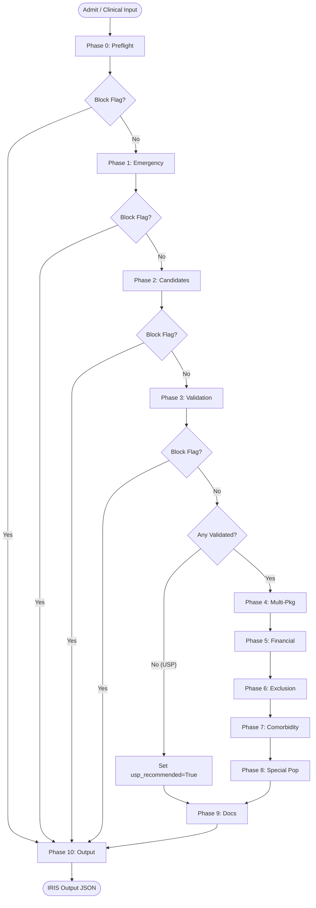

# IRIS Pre-Auth Package Selection Engine — System Design
===========================================================

This document serves as the absolute source of truth for the architecture, data models, knowledge base schemas, and processing pipeline of the IRIS pre-authorisation engine. 

IRIS is a deterministic multi-phase selection and validation engine designed to evaluate patient clinical inputs against PM-JAY (Ayushman Bharat) rules, specialty package masters, and Standard Treatment Guidelines (STGs).

---

## 1. Pipeline Overview

The IRIS pipeline is structured as an ordered sequence of 11 phases (Phases 0 through 10) executing on a shared mutable state object: the `IRISSession`. 

### Early-Exit Conditions
- **Block Flag Check:** After each of Phases 0, 1, 2, and 3, the orchestrator checks `session.has_block_flag()`. If any block flag is present, the pipeline immediately skips all remaining phases and jumps directly to Phase 10 (Output Assembly) to finalize the blocked response.
- **USP Pathway Check:** After Phase 3, if `session.validated_packages` is empty (and no block flags were raised), the orchestrator triggers the **Unspecified Surgical Package (USP) pathway**:
  - `session.usp_recommended` is set to `True`.
  - A `USP_RECOMMENDED` warning flag is added.
  - Phases 4 through 8 are bypassed.
  - The pipeline runs Phase 9 (Document Gap Analysis) and then Phase 10.



### Detailed Phase Specifications

#### Phase 0: Preflight Gates
- **Reads:** `session.input_data` (`patient.patient_id`, `hospital.hospital_id`), `session.clinical.is_medico_legal`.
- **Writes:** `session.patient` (`PatientContext`), `session.hospital` (`HospitalContext`), `session.patient_eligible` (`bool`), `session.hospital_empanelled` (`bool`), `session.mlc_required` (`bool`).
- **Logic:** Queries the Beneficiary Identification System (BIS) and Hospital Empanelment Module (HEM) stubs. Checks if the hospital scheme is `"pmjay"`. Sets `mlc_required` to match the clinical inputs.
- **Failures:** Appends `PREFLIGHT_FAILED` (block), `PATIENT_NOT_IN_BIS` (block), or `SCHEME_NOT_SUPPORTED` (block) flags on failure.

#### Phase 1: Emergency Routing
- **Reads:** `session.clinical.vitals`, `session.clinical.chief_complaints`.
- **Writes:** `session.is_emergency` (`bool`), `session.er_package_code` (`str | None`), `session.needs_specialty_package` (`bool`).
- **Logic:** *Currently Stubbed.* Assumes elective planned admission (`is_emergency = False`, `er_package_code = None`, `needs_specialty_package = True`). Adds the `EMERGENCY_PHASE_STUBBED` info flag.

#### Phase 2: Candidate Generation
- **Reads:** `session.clinical`, `session.hospital.empanelled_specialties`, `session.hospital.type`.
- **Writes:** `session.candidate_packages` (`list[CandidatePackage]`).
- **Logic:** Runs candidate search based on `PHASE2_SEARCH_MODE` (fuzzy rapidfuzz token-set matching vs Gemini-based search) against `data/hbp/_index.json`. Filters candidates by hospital specialty empanelment and public-reservation flags.
- **Failures:** Emits `CANDIDATE_GENERATION_FAILED` (block) on error, or `NO_CANDIDATES_FOUND` (warning) if zero candidates return.

#### Phase 3: Candidate Validation
- **Reads:** `session.candidate_packages`, `session.clinical`, `session.hospital`, `session.patient`.
- **Writes:** `session.validated_packages` (`list[ValidatedPackage]`), `session.phase3_blocked` (`list[dict]`), `session.stg_coverage` (`dict`).
- **Logic:** For each candidate package, loads its specialty JSON shard:
  1. Validates public-only reservations against hospital type.
  2. Classifies billing type (`surgical`, `fixed_medical`, `per_day`, `day_care`).
  3. Evaluates clinical eligibility using the Gemini-powered STG checker. Falls back to a lightweight LLM plausibility check if the STG shard is missing.
  4. Resolves bed-category stratification (using `clinical.bed_category`) or clinical keyword stratification.
  5. Resolves duplicate variants of the same package code using the LLM stratum tiebreaker.
  6. Calculates enhancement requests needed based on indicative length of stay (LoS).
  7. Pre-calculates implant costs and age boundaries.
- **Failures:** Packages that fail validation are moved to `session.phase3_blocked` with appropriate reason codes (e.g. `STG_NOT_ELIGIBLE`, `PUB_RESERVED_BLOCK`).

#### Phase 4: Multi-Package Combination Rules
- **Reads:** `session.validated_packages`, `session.clinical`.
- **Writes:** `session.final_package_set` (`list[FinalPackage]`).
- **Logic:**
  1. Calls the LLM conflict resolver to drop mutually exclusive or sub-included packages.
  2. Classifies packages into billing buckets.
  3. Applies PM-JAY combination rules: drops per-day packages if surgical/day-care packages exist; keeps only the highest-scored per-day package if multiple exist.
  4. Separates standalone packages (`procedure_label == "standalone"`) into a separate pre-auth group (`pre_auth_group = 2`).
  5. Validates and drops orphan add-ons lacking a parent package or diagnostic high-end add-ons lacking a per-day medical parent.
  6. Orders regular surgical packages by base rate and assigns deduction factors (`100%`, `50%`, `25%` rule).

#### Phase 5: Wallet Sufficiency Check
- **Reads:** `session.final_package_set`, `session.patient`, `session.hospital`.
- **Writes:** `session.wallet_sufficient` (`bool`), `session.copayment_required` (`bool`), `session.copayment_gap_inr` (`int | None`), `session.estimated_total_inr` (`int`).
- **Logic:** Sums the base rates of all active packages multiplied by their deduction factors. Identifies Vay Vandana Yojana dual-wallet eligibility (for senior citizens age ≥70). Checks available balance. If cost exceeds balance, computes the copayment gap.
- **Failures:** Emits `WALLET_INSUFFICIENT` (warning) and sets `copayment_required = True` on deficit.

#### Phase 6: Exclusion Verification
- **Reads:** `session.final_package_set`, `session.patient.age`, `session.clinical`.
- **Writes:** Mutates `session.final_package_set` (drops excluded packages) and appends block flags.
- **Logic:** Scans clinical text against keywords for 9 standard Annexure 5 clinical exclusions (OPD-only, Dental, Infertility, Vaccination, Cosmetic, Circumcision under 2 years, PVS, Drug Rehab, Sex Change).
  - **Group C (OPD, Vaccination, PVS, Sex Change):** Warns immediately; no exceptions.
  - **Group B (Infertility, Circumcision):** Warns immediately; checks basic exception triggers (e.g. circumcision age check).
  - **Group A (Dental, Cosmetic, Drug Rehab):** Invokes the Gemini Exception Evaluator to check if clinical documentation justifies an exception (e.g., dental bone trauma). If no exception is found, drops affected packages.
- **Failures:** Emits `<EXCLUSION>_BLOCKED` (block) flag if a Group A exclusion is verified without exception.

#### Phase 7: Comorbidity Resolution
- **Reads:** `session.clinical.comorbidities`, `session.final_package_set`.
- **Writes:** `session.comorbidity_notes` (`list[str]`).
- **Logic:** Verifies if comorbidities fall under a list of 24 standard "management conditions" (diabetes, hypertension, asthma, etc.). If the primary admission is surgical, these are absorbed (i.e. cannot be billed separately). Non-standard conditions trigger review flags.

#### Phase 8: Special Populations Advice
- **Reads:** `session.patient`, `session.final_package_set`, `session.hospital`.
- **Writes:** Appends flags to `session.flags`.
- **Logic:** Evaluates routing flags for:
  - Neonatal escalation risks (age 0 / ≤28 days).
  - Paediatric implant warnings (age ≤14).
  - Oncology requirements (specialties `MO`, `MR`, `SC`) — triggers mandatory Multidisciplinary Tumour Board (MTB) check.
  - Organ transplant procedures (specialty `OT`) — triggers NOTTO ID requirements.
  - Interstate portability (patient home state ≠ hospital state) — flags TAT adjustments and reimbursement warning risks.

#### Phase 9: Document Gap Analysis
- **Reads:** `session.final_package_set`, `session.clinical`, `session.hospital`, `session.mlc_required`, `session.flags`.
- **Writes:** `session.preauth_docs_required` (`list[DocumentItem]`), `session.preauth_docs_missing` (`list[DocumentItem]`).
- **Logic:** Compiles the required document checklist:
  - **Universal:** `clinical_notes` and `patient_photo` (waived for public hospitals).
  - **Conditional:** MLC papers (`mlc_fir`, `self_declaration`), NOTTO IDs (transplants), MTB approval notes (oncology), or USP justifications (USP pathway).
  - **Per-Package:** Shard-defined mandatory documents (waived for public hospitals under Annexure 7 relaxation).
  Checks presence against `clinical.non_clinical_documents_in_hand` and investigation reports.

#### Phase 10: Output Assembly
- **Reads:** All session variables (pure read).
- **Writes:** None. Returns an `IRISOutput` object.
- **Logic:** Compiles final fields. Evaluates the hierarchical pre-auth readiness status (see Output Schema).

---

## 2. File Structure

```
IRIS-Phase-1/
│
├── config.py                     # Configuration constants, paths, thresholds, and search mode
├── logger_setup.py               # Setup function for standardized console logging formatting
├── input_validator.py            # JSON schema validation rules for incoming payload
├── models.py                     # Dataclasses representing domain models (strictly type-annotated)
├── session.py                    # Spined state object (IRISSession) for pipeline execution
├── main.py                       # Orchestrator, clinical parser, CLI entry point & print summary
├── app.py                        # Streamlit web dashboard for interactive testing
├── eval.py                       # Evaluation framework executing test cases against answer key
│
├── kb/
│   ├── loader.py                 # Shard-level JSON file loaders and caches
│   ├── searcher.py               # Fuzzy search engine utilizing rapidfuzz
│   ├── searcher_llm.py           # Gemini-based candidate search engine
│   └── searcher_router.py        # Router redirecting searches to fuzzy or LLM based on config
│
├── llm/
│   ├── conflict_resolver.py      # LLM check for mutual exclusions and sub-inclusions
│   ├── nearest_match.py          # LLM identification of closest blocked candidate post-failure
│   └── stg_checker.py            # LLM check for STG guidelines, plausibility, & stratum ties
│
├── phases/
│   ├── phase0_preflight.py       # Patient verification (BIS) and hospital check (HEM)
│   ├── phase1_emergency.py       # Emergency package check (stubbed)
│   ├── phase2_candidates.py      # Pipeline runner wrapper for candidate generation
│   ├── phase3_validator.py       # Validation logic: rules, STGs, implants, enhancements
│   ├── phase4_multipackage.py    # PM-JAY package combinations and deduction factor ordering
│   ├── phase5_financial.py       # Wallet balance sufficiency check and Vay Vandana allocation
│   ├── phase6_exclusion.py       # Scanner and LLM exception engine for Annexure 5 exclusions
│   ├── phase7_comorbidity.py     # Management conditions comorbidity absorption
│   ├── phase8_special_pop.py     # Specialty advice (neonates, pediatric, cancer MTB, NOTTO)
│   ├── phase9_documents.py       # Document checklist compilation and missing gap checker
│   └── phase10_output.py         # Readiness status calculation and output serialization
│
├── stubs/
│   ├── bis_stub.py               # Mock client reading dummy_bis.json for patient details
│   └── hem_stub.py               # Mock client reading dummy_hem.json for hospital details
│
└── data/
    ├── KB_SPEC.md                # Structural specifications for knowledge bases
    ├── dummy/
    │   ├── dummy_bis.json        # Patient dummy database records
    │   └── dummy_hem.json        # Hospital dummy database records
    ├── schemes/
    │   └── pmjay.json            # PM-JAY core configuration master (KB-1)
    ├── hbp/
    │   ├── _index.json           # Flat index of all procedure codes across specialties (KB-2)
    │   └── <specialty>.json      # Category package master shards (KB-2)
    └── stg/
        └── <procedure_code>.json # Standard Treatment Guideline json files (KB-3)
```

---

## 3. Data Models (`models.py`)

All core dataclasses used inside the pipeline are defined in `models.py`:

```python
@dataclass
class WalletBalance:
    family_balance_inr: int
    vay_vandana_balance_inr: int | None
    policy_year_start: str

@dataclass
class PastClaim:
    procedure_code: str
    admission_date: str
    package_amount_inr: int
    status: str

@dataclass
class PatientContext:
    patient_id: str
    family_id: str
    name: str
    age: int
    gender: str
    home_state: str
    home_district: str
    wallet: WalletBalance
    past_claims: list[PastClaim] = field(default_factory=list)

@dataclass
class HospitalContext:
    hospital_id: str
    name: str
    type: str
    city_tier: str
    state: str
    district: str
    is_aspirational_district: bool
    accreditation: str
    scheme: str
    empanelled_specialties: list[str]

@dataclass
class StructuredValue:
    parameter: str
    value: float | str | None
    unit: str | None
    flag: str | None
    leads: str | None

@dataclass
class Investigation:
    type: str
    result_summary: str | None
    structured_values: list[StructuredValue] | None
    document_available: bool
    report_date: str | None

@dataclass
class DocumentInHand:
    key: str
    label: str
    available: bool

@dataclass
class ExaminationFindings:
    general: str | None
    cvs: str | None
    rs: str | None
    abdomen: str | None
    cns: str | None
    local: str | None

@dataclass
class PersonalHistory:
    smoking: str | None
    alcohol: str | None
    diet: str | None

@dataclass
class TreatingDoctor:
    name: str
    registration_number: str
    qualification: str
    specialty_code: str

@dataclass
class ClinicalInput:
    admission_date: str | None
    bed_category: str | None
    is_emergency: bool
    is_medico_legal: bool
    chief_complaints: str
    duration_days: int
    history_of_present_illness: str | None
    provisional_diagnosis: str
    planned_procedure: str | None
    weight_kg: float | None
    height_cm: float | None
    vitals: dict
    examination_findings: ExaminationFindings | None
    investigations: list[Investigation]
    comorbidities: list[str]
    past_medical_history: str | None
    past_surgical_history: str | None
    current_medications: list[str] = field(default_factory=list)
    allergies: list[str] = field(default_factory=list)
    personal_history: PersonalHistory | None = None
    family_history: str | None = None
    non_clinical_documents_in_hand: list[DocumentInHand] = field(default_factory=list)
    treating_doctor: TreatingDoctor | None = None
    notes: str | None = None

@dataclass
class CandidatePackage:
    procedure_code: str
    package_code: str
    specialty_code: str
    specialty: str
    package_name: str
    procedure_name: str
    billing_unit: str
    reserved_public_only: bool
    procedure_label: str
    auto_approved: str
    day_care: bool
    base_rate_inr: int | None
    match_score: float

@dataclass
class StratificationResult:
    determinable: bool
    selected_stratum: str | None
    note: str | None

@dataclass
class ImplantResult:
    required: bool
    name: str | None
    cost_inr: int | None
    age_appropriate: bool
    gender_appropriate: bool
    quantity: int | None

@dataclass
class ValidatedPackage:
    procedure_code: str
    package_code: str
    specialty_code: str
    package_name: str
    procedure_name: str
    billing_type: str
    billing_unit: str
    procedure_label: str
    auto_approved: str
    enhancement_applicable: bool
    enhancement_requests_needed: int | None
    reserved_public_only: bool
    base_rate_inr: int | None
    stratification: StratificationResult
    implant: ImplantResult
    special_conditions_popup: bool
    special_conditions_rule: bool
    stg_eligible: bool
    stg_missing_criteria: list[str] = field(default_factory=list)
    stg_reasoning: str | None = None
    is_addon_to: list[str] | None = None
    addon_type: str | None = None
    match_score: float = 0.0
    flags: list[str] = field(default_factory=list)

@dataclass
class FinalPackage:
    validated: ValidatedPackage
    role: str
    deduction_factor: float
    pre_auth_group: int

@dataclass
class DocumentItem:
    key: str
    label: str
    package_code: str | None
    available: bool
    criticality: str

@dataclass
class Flag:
    code: str
    message: str
    severity: str

@dataclass
class EnhancementPlan:
    procedure_code: str
    estimated_requests: int
    batch_size_used: int
    los_indicative_days: int
    caveat: str

@dataclass
class IRISOutput:
    readiness_status: str
    selected_packages: list[FinalPackage] = field(default_factory=list)
    blocked_candidates: list[dict] = field(default_factory=list)
    preauth_docs_required: list[DocumentItem] = field(default_factory=list)
    preauth_docs_missing: list[DocumentItem] = field(default_factory=list)
    enhancement_plan: list[EnhancementPlan] = field(default_factory=list)
    copayment_required: bool = False
    copayment_gap_inr: int | None = None
    comorbidity_notes: list[str] = field(default_factory=list)
    flags: list[Flag] = field(default_factory=list)
    stg_coverage: dict = field(default_factory=lambda: {"validated": 0, "stg_missing": 0})
    errors: list[str] = field(default_factory=list)
```

---

## 4. Knowledge Base (KB) Architecture

IRIS utilizes a sharded JSON-based Knowledge Base layout split across five conceptual tiers:

| KB Tier | Description | Source File Location | Status |
| :--- | :--- | :--- | :--- |
| **KB-1** | Core Scheme Rules (Entitlements, bed definitions, default limits) | `data/schemes/pmjay.json` | **Active** |
| **KB-2** | Specialty Shards & Index (Procedures, public flags, billing rules, implants) | `data/hbp/` & `data/hbp/_index.json` | **Active** |
| **KB-3** | Standard Treatment Guidelines (Clinical requirements, age, qualification checks) | `data/stg/` (individual JSON shards) | **Active** |
| **KB-4** | Query / Deduction Taxonomy (Structured rules mapping missing criteria to codes) | `data/query_taxonomy.json` | **Not Started** (Sample at `data/samples/`) |
| **KB-5** | State Overrides & State Variant Rules (CMCHIS Tamil Nadu details) | `data/schemes/cmchis.json` | **Not Started** |

---

## 5. LLM Usage Policy

IRIS integrates LLM calls selectively for tasks requiring clinical reasoning. The system maintains a **fail-open and graceful degradation policy**: if any LLM call fails, the transaction is not aborted. Instead, a warning flag is raised, a technical error is logged, and a deterministic fallback is executed.

### Core LLM Functions

1. **`kb/searcher_llm.py::search_candidates`**
   - **Trigger:** Configured when `PHASE2_SEARCH_MODE = "llm"`.
   - **Task:** Matches unstructured patient presentation details (diagnosis, complaints) against the flat catalog in `_index.json` to extract candidate codes.
   - **Fallback:** No candidates returned (or switches to fuzzy matching).

2. **`llm/stg_checker.py::check_stg_eligibility`**
   - **Trigger:** Phase 3 STG validation for a candidate procedure when its corresponding STG JSON file is available.
   - **Task:** Parses clinical parameters against rule-sets defined in the STG schema to declare suitability.
   - **Fallback:** Marks patient as `eligible=True` but appends the `STG_LOW_CONFIDENCE` flag.

3. **`llm/stg_checker.py::check_plausibility`**
   - **Trigger:** Phase 3 validation when an STG file is missing.
   - **Task:** Lightweight clinical evaluation checking if the planned procedure is logical given the patient's complaints.
   - **Fallback:** Declares candidate plausible.

4. **`llm/stg_checker.py::resolve_stratum`**
   - **Trigger:** Phase 3 stratum duplicate tiebreaker.
   - **Task:** Compares overlapping variants of a package code and picks the single best fit.
   - **Fallback:** Defaults to the variant with the highest rapidfuzz string matching score (`fuzz.WRatio`).

5. **`llm/conflict_resolver.py::resolve_conflicts`**
   - **Trigger:** Phase 4 conflict resolution.
   - **Task:** Detects clinical overlaps, mutual exclusions, and sub-inclusions (e.g. billing for both a partial and total thyroidectomy).
   - **Fallback:** Retains all validated packages.

6. **`phases/phase6_exclusion.py::_check_exclusion_with_llm`**
   - **Trigger:** Phase 6 Group A clinical exclusions keyword match.
   - **Task:** Evaluates whether a documented exception applies to allow billing (e.g., cosmetic exception for trauma reconstruction).
   - **Fallback:** Retains the package; flags a warning for manual audit.

7. **`llm/nearest_match.py::get_nearest_match`**
   - **Trigger:** Pipeline run yields zero selected packages.
   - **Task:** Identifies the single most relevant blocked candidate and summarizes the clinical deficit in under 120 characters.
   - **Fallback:** Returns `None`.

### Model Settings
- **Target Model:** `gemini-2.5-flash`
- **Temperature:** `0` (for maximum determinism and consistency)
- **Timeout:** `30` seconds
- **Max Retries:** `2`

---

## 6. Flag Codes & Reason Codes

IRIS separates administrative and clinical statuses into flags (visible to users/MEDCO) and reason codes (internal to blocked candidate structures).

### Business Flag Codes

| Flag Code | Severity | Emitted By | Trigger Condition / Description |
| :--- | :--- | :--- | :--- |
| **`PREFLIGHT_FAILED`** | `block` | Phase 0 | Exception during patient/hospital verification stubs |
| **`PATIENT_NOT_IN_BIS`** | `block` | Phase 0 | Patient ID is not present in BIS dummy database |
| **`SCHEME_NOT_SUPPORTED`** | `block` | Phase 0 | Admitting hospital scheme is not `"pmjay"` |
| **`EMERGENCY_PHASE_STUBBED`** | `info` | Phase 1 | Temporary warning that emergency routing is stubbed |
| **`CANDIDATES_GENERATED`** | `info` | Phase 2 | Successfully identified candidate procedures |
| **`NO_CANDIDATES_FOUND`** | `warning` | Phase 2 | Fuzzy or LLM search yielded no candidate packages |
| **`CANDIDATE_GENERATION_FAILED`**| `block` | Phase 2 | Exception caught during candidate search |
| **`NO_VALIDATED_PACKAGES`** | `warning` | Phase 3 | All generated candidates were blocked in Phase 3 |
| **`USP_RECOMMENDED`** | `warning` | `main.py` | Bypasses standard rules to recommend Unspecified Surgical Pathway |
| **`CONFLICT_RESOLVED`** | `info` | Phase 4 | Overlapping package variants dropped by LLM Conflict Resolver |
| **`SURGICAL_PERDAY_BLOCKED`** | `warning` | Phase 4 | Dropped medical per-day package due to surgical combo rule |
| **`PERDAY_MULTIPLE_BLOCKED`** | `warning` | Phase 4 | Dropped extra medical per-day packages (only 1 allowed) |
| **`STANDALONE_SPLIT`** | `info` | Phase 4 | Split standalone package into separate `pre_auth_group=2` |
| **`ADDON_PARENT_UNKNOWN`** | `warning` | Phase 4 | Dropped add-on lacking specified parent mappings |
| **`ADDON_PARENT_MISSING`** | `warning` | Phase 4 | Dropped add-on because parents are not present in current selection |
| **`DIAGNOSTIC_ADDON_BLOCKED`** | `warning` | Phase 4 | Dropped high-end diagnostic add-on due to missing per-day parent |
| **`DEDUCTION_APPROXIMATE`** | `info` | Phase 4 | Flag indicating rate deductions order used base rates as proxy |
| **`RATE_NULL_FOR_PERDAY`** | `info` | Phase 5 | Est. total excludes per-day packages lacking index base rates |
| **`VAY_VANDANA_DEBIT_ORDER_AMBIGUOUS`**| `warning`| Phase 5 | Warning for dual-wallet senior citizens; requires manual order selection |
| **`WALLET_INSUFFICIENT`** | `warning` | Phase 5 | Total package cost exceeds available balance(s) |
| **`FINANCIAL_ESTIMATE_APPROXIMATE`**| `info` | Phase 5 | CAVET flag that cost estimates exclude multipliers |
| **`EXCLUSION_<CAT>_RISK`** | `warning` | Phase 6 | Keywords trigger warning for specific exclusion categories |
| **`EXCLUSION_<CAT>_RISK_BLOCKED`**| `block` | Phase 6 | Group A exclusion verified with no exceptions; package dropped |
| **`COMORBIDITY_REVIEW_NEEDED`** | `info` | Phase 7 | Non-standard comorbidity found; needs manual clinical audit |
| **`NEONATAL_ESCALATION_RISK`** | `warning` | Phase 8 | Neonatal patient (age 0); escalation package mapping warning |
| **`PAEDIATRIC_DEVICE`** | `info` | Phase 8 | Child patient (age ≤14); pediatric sizing rule reminder |
| **`MTB_REQUIRED`** | `warning` | Phase 8 | Oncology package selected; requires Multidisciplinary Tumour Board |
| **`ONCOLOGY_MULTI_STAGE`** | `info` | Phase 8 | Oncology stages notification; IRIS evaluates current stage only |
| **`PORTABILITY_CASE`** | `info` | Phase 8 | Portability alert (interstate patient); warning for longer TAT |
| **`NOTTO_DOCS_REQUIRED`** | `warning` | Phase 8 | Transplant package selected; NOTTO ID verification warning |
| **`DOC_GAP_ANALYSIS`** | `info` | Phase 9 | Informational checklist execution details |
| **`MANDATORY_DOCS_MISSING`** | `warning` | Phase 9 | One or more hard-block documents are missing from payload |

### Candidate Block Reason Codes

Reason codes appended to `session.phase3_blocked` during evaluation:

- **`SPECIALTY_CODE_UNKNOWN`**: specialty code has no shard mapping.
- **`SHARD_NOT_FOUND`**: specialty JSON file missing from `data/hbp/`.
- **`PROCEDURE_NOT_IN_SHARD`**: procedure code is missing from specialty shard.
- **`PUB_RESERVED_BLOCK`**: public-only package booked by a private hospital.
- **`STG_REQUIRED`**: STG file missing when `REQUIRE_STG_FOR_VALIDATION` is `True`.
- **`PLAUSIBILITY_FAILED`**: failed the clinical plausibility check (when STG is missing).
- **`STG_NOT_ELIGIBLE`**: clinical criteria outlined in the STG guideline were not met.
- **`STRATUM_NOT_SELECTED`**: variant dropped by LLM stratum tiebreaker.

---

## 7. Config Constants (`config.py`)

Constants in `config.py` control various aspects of the pipeline:

- **`PROJECT_ROOT` / `DATA_DIR` / `HBP_DIR` / `STG_DIR` / `SCHEMES_DIR` / `DUMMY_DIR` / `INDEX_FILE` / `PMJAY_RULES_FILE` / `QUERY_TAXONOMY_FILE` / `DUMMY_BIS_FILE` / `DUMMY_HEM_FILE`:** Absolute path pointers to data catalogs and mock database stubs.
- **`TOP_N_CANDIDATES`** (30): Max count of packages processed by candidate generators.
- **`MIN_FUZZY_SCORE`** (50): Minimum rapidfuzz score required to retain a candidate.
- **`ENHANCEMENT_BATCH_PRIVATE`** (2): Enhancement request batch size (in days) for private hospitals.
- **`ENHANCEMENT_BATCH_PUBLIC`** (5): Enhancement request batch size (in days) for public or NE-region hospitals.
- **`NE_STATES_AND_ISLANDS`**: List of locations qualifying for public-tier enhancement batching.
- **`REQUIRE_STG_FOR_VALIDATION`** (`False`): If `True`, missing STG files trigger a hard block (`STG_REQUIRED`); if `False`, falls back to a clinical plausibility LLM check.
- **`LLM_MODEL`** (`"gemini-2.5-flash"`): Targeted model version.
- **`LLM_TIMEOUT_SECONDS`** (30): Timeout limit for API requests.
- **`LLM_MAX_RETRIES`** (2): Retry count for transient LLM errors.
- **`SENIOR_CITIZEN_AGE`** (70): Age threshold for Vay Vandana Yojana wallet eligibility.
- **`PAEDIATRIC_AGE_MAX`** (14): Age limit for pediatric implant guidelines.
- **`FAMILY_WALLET_DEFAULT_INR`** (500,000): Default annual family limit.
- **`VAY_VANDANA_WALLET_INR`** (500,000): Additional wallet limit for seniors.
- **`PHASE2_SEARCH_MODE`** (`"llm"`): Candidate search backend (`"fuzzy"` or `"llm"`).

---

## 8. Known Gaps & Stubs

The following gaps are present in the MVP and represent areas for future development:

1. **Phase 1 (Emergency Routing):** Currently a stub that assumes elective planned admissions. Needs to map vitals and chief complaints to emergency codes.
2. **KB-4 (Query / Deduction Taxonomy):** The production `data/query_taxonomy.json` file is missing. The system uses a placeholder schema at `data/samples/query_taxonomy.json`.
3. **KB-5 (State Overrides CMCHIS):** Tamil Nadu state override logic and variant scheme files are missing.
4. **Phase 4 Deduction Factors Ordering:** Uses base rate as a proxy for sorting surgical packages. PM-JAY requires ordering by final calculated rates, which are computed in Phase 5.
5. **Phase 8 Paediatric Device Limits:** Sizing calculations for pediatric devices are mock-guided; they do not perform dynamic physical range validations on implants.
6. **LoS Persistence in EnhancementPlan:** `ValidatedPackage` does not persist the raw `los_indicative` integer used during Phase 3. As a result, the `los_indicative_days` field in `EnhancementPlan` is returned as a placeholder `0`.
7. **Hospital Context Empanelment Gate:** The HEM stub in Phase 0 always assumes empanelled status.
