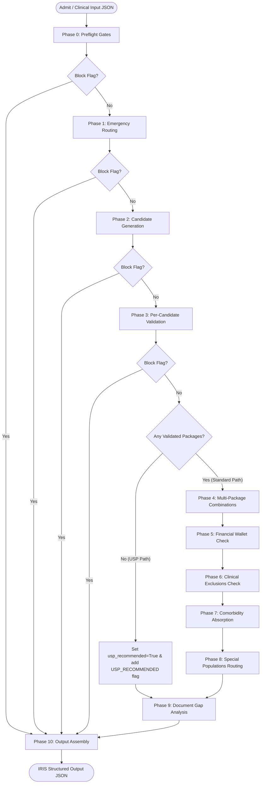
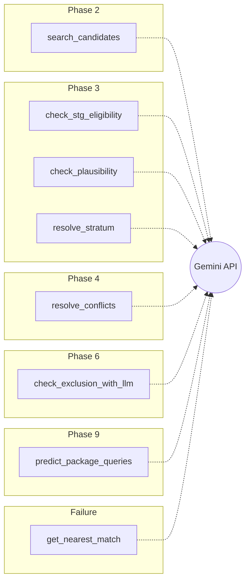

# IRIS Pre-Auth Package Selection Engine — System Design
===========================================================

This document serves as the absolute source of truth for the architecture, data models, knowledge base schemas, processing pipeline, and LLM integrations of the IRIS pre-authorisation engine. 

IRIS is an advanced, multi-phase decision-support engine designed to evaluate patient clinical inputs against PM-JAY (Ayushman Bharat) business rules, specialty package masters, and Standard Treatment Guidelines (STGs).

---

## 1. Pipeline Overview

The IRIS pipeline orchestrates pre-authorisation request processing through an ordered sequence of 11 sequential phases (Phases 0 through 10) executing on a shared, mutable state container: the `IRISSession`. 

### Pipeline Orchestration & Early Exits

1. **State Mutation:** Each phase reads from the `IRISSession`, performs specific business/clinical checks, and writes results, errors, or flags back to the session.
2. **Early Exit (Block Flag Check):** After each of the early phases (Phase 0, Phase 1, Phase 2, and Phase 3), the orchestrator checks `session.has_block_flag()`. If any flag with `severity == "block"` is present, the pipeline immediately halts execution, skips all remaining phases, and jumps to Phase 10 (Output Assembly).
3. **Unspecified Surgical Package (USP) Pathway:** After Phase 3, if `session.validated_packages` is empty (meaning no candidate package passed clinical validation), the orchestrator initiates the USP pathway:
   - `session.usp_recommended` is set to `True`.
   - The warning flag `USP_RECOMMENDED` is added to the session.
   - Phases 4 through 8 are completely bypassed (saving LLM latency and API calls).
   - The pipeline executes Phase 9 (Document Gap Analysis) and Phase 10 (Output Assembly) directly.
4. **Standard Pathway:** If one or more packages survive Phase 3 validation, the pipeline completes the standard execution flow: Phase 4 $\rightarrow$ Phase 5 $\rightarrow$ Phase 6 $\rightarrow$ Phase 7 $\rightarrow$ Phase 8 $\rightarrow$ Phase 9 $\rightarrow$ Phase 10.



---

### Detailed Phase Specifications

#### Phase 0: Preflight Gates
*   **Source File:** `phases/phase0_preflight.py`
*   **Reads:** `session.input_data` (`patient.patient_id`, `hospital.hospital_id`), `session.clinical.is_medico_legal`.
*   **Writes:** `session.patient` (`PatientContext`), `session.hospital` (`HospitalContext`), `session.patient_eligible` (`bool`), `session.hospital_empanelled` (`bool`), `session.mlc_required` (`bool`).
*   **Logic:**
    1.  Queries the Beneficiary Identification System (BIS) stub using `patient_id`. If `None`, raises `PATIENT_NOT_IN_BIS` block flag and exits early.
    2.  Queries the Hospital Empanelment Module (HEM) stub using `hospital_id`.
    3.  Asserts hospital scheme eligibility. Critical Rule: Admitting hospital scheme must be exactly `"pmjay"`. If not, raises `SCHEME_NOT_SUPPORTED` block flag.
    4.  Initialises `mlc_required` to match the clinical input's `is_medico_legal` flag.
*   **Failures:** If any exception is caught, appends `PREFLIGHT_FAILED` block flag.

#### Phase 1: Emergency Routing
*   **Source File:** `phases/phase1_emergency.py`
*   **Reads:** `session.clinical.vitals`, `session.clinical.chief_complaints`.
*   **Writes:** `session.is_emergency` (`bool`), `session.er_package_code` (`str | None`), `session.needs_specialty_package` (`bool`).
*   **Logic:** *Stubbed for MVP.* Always assumes non-emergency planned elective admission (`is_emergency = False`, `er_package_code = None`, `needs_specialty_package = True`). Emits the informational flag `EMERGENCY_PHASE_STUBBED`.
*   **Future Design:** Will map GCS, SpO2, and BP to emergency codes and trigger dual-pre-auth routing if expected hospitalisation exceeds 12 hours.

#### Phase 2: Candidate Generation
*   **Source File:** `phases/phase2_candidates.py`
*   **Reads:** `session.clinical`, `session.hospital.empanelled_specialties`, `session.hospital.type`.
*   **Writes:** `session.candidate_packages` (`list[CandidatePackage]`).
*   **Logic:**
    *   If `PHASE2_SEARCH_MODE == "fuzzy"`, executes RapidFuzz `token_set_ratio` string matching between clinical `provisional_diagnosis`/`planned_procedure` and row aliases in `data/hbp/_index.json`.
    *   If `PHASE2_SEARCH_MODE == "llm"`, constructs a semantic query and calls Gemini (`gemini-2.5-flash`) to parse unstructured presentation data and match it to specific procedure codes.
    *   Applies a hard filter: candidates must belong to the hospital's `empanelled_specialties`.
    *   Applies public-hospital reservation filter: if the procedure is reserved for public hospitals only (`reserved_public_only == True`) and the hospital type is private, the candidate is dropped.
*   **Failures:** If no candidates are found, adds the warning flag `NO_CANDIDATES_FOUND`. Caught exceptions emit `CANDIDATE_GENERATION_FAILED` block flag.

#### Phase 3: Per-Candidate Validation
*   **Source File:** `phases/phase3_validator.py`
*   **Reads:** `session.candidate_packages`, `session.clinical`, `session.hospital`, `session.patient`.
*   **Writes:** `session.validated_packages` (`list[ValidatedPackage]`), `session.phase3_blocked` (`list[dict]`), `session.stg_coverage` (`dict`).
*   **Logic:** For each candidate package:
    1.  Loads the corresponding specialty HBP JSON shard (e.g. `burns_management.json`).
    2.  Validates public-hospital restrictions (`reserved_public_only`). If private hospital attempts to book, blocks candidate with `PUB_RESERVED_BLOCK`.
    3.  Classifies the procedure billing type (surgical, daycare, fixed medical, per-day medical).
    4.  Loads the corresponding Standard Treatment Guideline (STG) JSON. If STG exists, calls Gemini to evaluate clinical parameter thresholds (e.g. burns depth, vitals) against clinical inputs. If STG file is missing:
        - If `REQUIRE_STG_FOR_VALIDATION == True`, blocks candidate with `STG_REQUIRED`.
        - If `False` (default), runs a lightweight LLM clinical plausibility check. If implausible, blocks with `PLAUSIBILITY_FAILED`.
    5.  Resolves bed-category stratification for per-day medical management packages based on clinical `bed_category`.
    6.  Resolves implant requirements: extracts implant cost and checks for pediatric age boundaries.
    7.  Checks special conditions rules: scans patient past claims in the current policy year to prevent unauthorized repeat procedures.
    8.  Pre-calculates enhancement requests needed based on the package's indicative length of stay (LoS).
    9.  Orchestrates same-package duplicates: if multiple candidates resolve to the same package code, calls the LLM stratum tiebreaker to choose the single best fit and blocks others with `STRATUM_NOT_SELECTED`.
*   **Failures:** Unhandled exceptions append block reason `INTERNAL_ERROR` for the affected candidate. If zero packages pass, emits `NO_VALIDATED_PACKAGES` warning.

#### Phase 4: Multi-Package Combinations
*   **Source File:** `phases/phase4_multipackage.py`
*   **Reads:** `session.validated_packages`, `session.clinical`.
*   **Writes:** `session.final_package_set` (`list[FinalPackage]`).
*   **Logic:**
    1.  Calls the Gemini conflict resolver to scan the validated packages for clinical overlaps, mutual exclusions, or sub-inclusions (e.g. partial thyroidectomy sub-included in total thyroidectomy). Dropped packages trigger the `CONFLICT_RESOLVED` flag.
    2.  Groups remaining packages into billing buckets (surgical, fixed medical, per-day medical).
    3.  Applies PM-JAY combination rules:
        - Rule 5: Surgical + per-day medical is prohibited in the same pre-auth; drops all per-day packages and flags `SURGICAL_PERDAY_BLOCKED`.
        - Rule 6: Multiple per-day packages are prohibited; retains the highest-matched package, drops others, and flags `PERDAY_MULTIPLE_BLOCKED`.
    4.  Isolates standalone procedures (`procedure_label == "standalone"`) into a separate pre-authorisation submission group (`pre_auth_group = 2`), flagging `STANDALONE_SPLIT`.
    5.  Validates add-on procedures (Rules 11 & 12): drops add-ons missing their parent package (`ADDON_PARENT_MISSING` / `ADDON_PARENT_UNKNOWN`), and drops diagnostic high-end add-ons lacking a per-day medical primary (`DIAGNOSTIC_ADDON_BLOCKED`).
    6.  Applies the surgical sliding scale billing rule: orders regular surgical packages by `base_rate_inr` descending and assigns deduction factors: 100% for primary, 50% for secondary, and 25% for tertiary. Adds `DEDUCTION_APPROXIMATE` warning because base rates are used as a proxy for final rates.

#### Phase 5: Financial Wallet Check
*   **Source File:** `phases/phase5_financial.py`
*   **Reads:** `session.final_package_set`, `session.patient`, `session.hospital`.
*   **Writes:** `session.wallet_sufficient` (`bool`), `session.copayment_required` (`bool`), `session.copayment_gap_inr` (`int | None`), `session.estimated_total_inr` (`int`).
*   **Logic:**
    1.  Sums the base rates of all selected packages multiplied by their deduction factors. Excludes per-day packages with null base rates, emitting `RATE_NULL_FOR_PERDAY`.
    2.  Identifies senior citizen dual-wallet eligibility (age $\ge 70$ with active Ayushman Vay Vandana Card). Critical Rule: Exposes both wallets to the user and flags the debit-order decision ambiguity with `VAY_VANDANA_DEBIT_ORDER_AMBIGUOUS`.
    3.  Asserts wallet sufficiency. If estimated cost exceeds available balance, sets `wallet_sufficient = False`, `copayment_required = True`, computes the deficit, and raises `WALLET_INSUFFICIENT` warning.
    4.  Always emits `FINANCIAL_ESTIMATE_APPROXIMATE` to remind users that pricing excludes multipliers.

#### Phase 6: Clinical Exclusions Check
*   **Source File:** `phases/phase6_exclusion.py`
*   **Reads:** `session.final_package_set`, `session.patient.age`, `session.clinical`.
*   **Writes:** Mutates `session.final_package_set` (removes packages) and appends flags.
*   **Logic:**
    1.  Keyword-screens the clinical text (chief complaints, diagnosis, history, notes) against 9 standard Annexure 5 clinical exclusion categories.
    2.  **Group C (OPD-only, Vaccination, PVS, Sex Change):** Flags immediate warning (`EXCLUSION_<CAT>_RISK`). These conditions are always excluded; no exceptions apply.
    3.  **Group B (Infertility, Circumcision):** Flags immediate warning. Applies basic exception checks (e.g. circumcision age gate: only applies to age < 2).
    4.  **Group A (Dental, Cosmetic, Drug Rehab):** If keyword matches, calls Gemini to evaluate whether clinical records justify an official exception (e.g., dental treatment arising from bone trauma).
        - If exception applies: Retains packages, flags warning with verified exception note.
        - If exception does not apply: Drops affected packages from `final_package_set` and raises `EXCLUSION_<CAT>_RISK_BLOCKED` block flag.

#### Phase 7: Comorbidity Absorption
*   **Source File:** `phases/phase7_comorbidity.py`
*   **Reads:** `session.clinical.comorbidities`, `session.final_package_set`.
*   **Writes:** `session.comorbidity_notes` (`list[str]`), appends flags.
*   **Logic:** Scans patient comorbidities. PM-JAY Rule: Management of standard comorbidities (e.g. diabetes, hypertension, asthma, COPD) during a surgical admission is included in the surgical package rate.
    - If surgical admission: Writes comorbidity absorption notes (these cannot be billed separately).
    - If non-standard comorbidity is found, emits `COMORBIDITY_REVIEW_NEEDED` warning flag to trigger medical audit review.

#### Phase 8: Special Populations Routing
*   **Source File:** `phases/phase8_special_pop.py`
*   **Reads:** `session.patient`, `session.final_package_set`, `session.hospital`.
*   **Writes:** Appends advisory flags to `session.flags`.
*   **Logic:** Checks clinical profiles for special population flags:
    - **Neonatal:** (age 0 years): Emits `NEONATAL_ESCALATION_RISK` warning flag (reminds MEDCO that neonates deteriorating require immediate unblocking of standard packages for higher-level intensive care packages).
    - **Paediatric:** (age $\le 14$): Emits `PAEDIATRIC_DEVICE` info flag (reminder that pediatric implant sizes apply).
    - **Oncology:** (specialties `MO`, `MR`, `SC`): Emits `MTB_REQUIRED` warning (requires Multidisciplinary Tumour Board approval) and `ONCOLOGY_MULTI_STAGE` info flag.
    - **Transplant:** (specialty `OT`): Emits `NOTTO_DOCS_REQUIRED` warning (requires recipient and donor NOTTO IDs and workups).
    - **Interstate Portability:** (patient state $\ne$ hospital state): Emits `PORTABILITY_CASE` info flag (TAT increases to 30 days, warns that home states may reject private hospital bookings of public-reserved packages).

#### Phase 9: Document Gap Analysis
*   **Source File:** `phases/phase9_documents.py`
*   **Reads:** `session.final_package_set`, `session.clinical`, `session.hospital`, `session.mlc_required`, `session.flags`.
*   **Writes:** `session.preauth_docs_required` (`list[DocumentItem]`), `session.preauth_docs_missing` (`list[DocumentItem]`), `session.query_predictions` (`list[PackageQueryPrediction]`).
*   **Logic:**
    1.  Compiles the required document checklist:
        - **Universal:** `clinical_notes` and `patient_photo`.
        - **Conditional:** MLC files (`mlc_fir`, `self_declaration` if `mlc_required == True`), NOTTO IDs (for organ transplants), MTB approval (for oncology), or USP justification (if USP path).
        - **Per-Package:** Shard-defined mandatory pre-auth documents.
    2.  *Public Hospital Relaxation:* If hospital type is public, all documents except `clinical_notes` are waived (Annexure 7 guidelines). Universal and package-specific documents are waived.
    3.  Compares required files against clinical input's `non_clinical_documents_in_hand` and investigation reports.
    4.  Fires the Gemini Query Predictor for each package to evaluate the likelihood of claims query rejections based on doctor qualification, duplicate claims history, and vitals.
*   **Failures:** Emits `DOC_GAP_ANALYSIS` info flag. If any missing document has `criticality == "hard_block"`, appends the `MANDATORY_DOCS_MISSING` warning flag.

#### Phase 10: Output Assembly
*   **Source File:** `phases/phase10_output.py`
*   **Reads:** All accumulated session state (read-only).
*   **Writes:** None. Assembles and returns `IRISOutput`.
*   **Logic:**
    - Resolves the hierarchical readiness status (first match wins):
        1. Any flag with `severity == "block"` $\rightarrow$ `BLOCKED`
        2. Any missing document with `criticality == "hard_block"` $\rightarrow$ `BLOCKED`
        3. Selected package set is empty AND `usp_recommended == False` $\rightarrow$ `BLOCKED`
        4. Any missing document with `criticality == "ppd_query_risk"` $\rightarrow$ `CONDITIONAL`
        5. Any flag with `severity == "warning"` $\rightarrow$ `READY_WITH_WARNINGS`
        6. Otherwise $\rightarrow$ `READY`
    - Pre-computes the enhancement plan for active per-day packages based on indicative LoS and hospital tier/region.

---

## 2. File Structure

```
e:\Code\1hat-phase1\
│
├── config.py                     # Configuration constants, paths, thresholds, and search mode
├── logger_setup.py               # Setup helper for standardized console logging formatting
├── input_validator.py            # JSON schema validation rules for incoming payload
├── models.py                     # Dataclasses representing domain models (strictly type-annotated)
├── session.py                    # Spined state object (IRISSession) for pipeline execution
├── main.py                       # Orchestrator, clinical parser, CLI entry point & print summary
├── app.py                        # Streamlit web dashboard for interactive testing
├── eval.py                       # Evaluation framework executing test cases against answer key
│
├── kb/
│   ├── loader.py                 # Shard-level JSON file loaders and caches
│   ├── searcher.py               # Fuzzy search engine utilizing rapidfuzz
│   ├── searcher_llm.py           # Gemini-based candidate search engine
│   └── searcher_router.py        # Router redirecting searches to fuzzy or LLM based on config
│
├── llm/
│   ├── conflict_resolver.py      # LLM check for mutual exclusions and sub-inclusions
│   ├── nearest_match.py          # LLM identification of closest blocked candidate post-failure
│   ├── query_predictor.py        # LLM prediction of claim queries, doctor qualifications, and vitals
│   └── stg_checker.py            # LLM check for STG guidelines, plausibility, & stratum ties
│
├── phases/
│   ├── phase0_preflight.py       # Patient verification (BIS) and hospital check (HEM)
│   ├── phase1_emergency.py       # Emergency package check (stubbed)
│   ├── phase2_candidates.py      # Pipeline runner wrapper for candidate generation
│   ├── phase3_validator.py       # Validation logic: rules, STGs, implants, enhancements
│   ├── phase4_multipackage.py    # PM-JAY package combinations and deduction factor ordering
│   ├── phase5_financial.py       # Wallet balance sufficiency check and Vay Vandana allocation
│   ├── phase6_exclusion.py       # Scanner and LLM exception engine for Annexure 5 exclusions
│   ├── phase7_comorbidity.py     # Management conditions comorbidity absorption
│   ├── phase8_special_pop.py     # Specialty advice (neonates, pediatric, cancer MTB, NOTTO)
│   ├── phase9_documents.py       # Document checklist compilation and missing gap checker
│   └── phase10_output.py         # Readiness status calculation and output serialization
│
├── stubs/
│   ├── bis_stub.py               # Mock client reading dummy_bis.json for patient details
│   └── hem_stub.py               # Mock client reading dummy_hem.json for hospital details
│
└── data/
    ├── KB_SPEC.md                # Structural specifications for knowledge bases
    ├── dummy/
    │   ├── dummy_bis.json        # Patient dummy database records
    │   └── dummy_hem.json        # Hospital dummy database records
    ├── schemes/
    │   └── pmjay.json            # PM-JAY core configuration master (KB-1)
    ├── hbp/
    │   ├── _index.json           # Flat index of all procedure codes across specialties (KB-2)
    │   └── <specialty>.json      # Category package master shards (KB-2)
    └── stg/
        └── <procedure_code>.json # Standard Treatment Guideline json files (KB-3)
```

---

## 3. Data Models (`models.py`)

All domain data models are defined as strictly type-annotated Python dataclasses:

### 1. `WalletBalance`
PM-JAY beneficiary wallet state at time of admission.
*   `family_balance_inr` (`int`): Primary family entitlement balance (₹5 lakh/year standard).
*   `vay_vandana_balance_inr` (`int | None`): Additional Vay Vandana Yojana entitlement for senior citizens (age $\ge 70$).
*   `policy_year_start` (`str`): ISO date string marking the start of the active policy year.

### 2. `PastClaim`
A single historical PM-JAY claim record for the beneficiary.
*   `procedure_code` (`str`): Code of the booked procedure.
*   `admission_date` (`str`): ISO date string.
*   `package_amount_inr` (`int`): Total billed amount in INR.
*   `status` (`str`): Current claim status (e.g. `"approved"`, `"rejected"`, `"pending"`).

### 3. `PatientContext`
Beneficiary identity and entitlement data loaded from the BIS stub.
*   `patient_id` (`str`): Unique identifier.
*   `family_id` (`str`): Unique family floater identifier.
*   `name` (`str`): Patient's full name.
*   `age` (`int`): Patient's age in years.
*   `gender` (`str`): `"M"` or `"F"`.
*   `home_state` (`str`): State of residence.
*   `home_district` (`str`): District of residence.
*   `wallet` (`WalletBalance`): entitlement balances.
*   `past_claims` (`list[PastClaim]`): Historical claim logs.

### 4. `HospitalContext`
Empanelled hospital profile loaded from the HEM stub.
*   `hospital_id` (`str`): Unique identifier.
*   `name` (`str`): Hospital name.
*   `type` (`str`): `"private"` or `"public"`.
*   `city_tier` (`str`): `"tier1"`, `"tier2"`, or `"tier3"`.
*   `state` (`str`): State of operation.
*   `district` (`str`): District of operation.
*   `is_aspirational_district` (`bool`): True if in an NHA-designated aspirational district.
*   `accreditation` (`str`): `"none"`, `"bronze"`, `"nabh_entry"`, `"nabh_full"`, or `"nqas"`.
*   `scheme` (`str`): scheme code (must be `"pmjay"`).
*   `empanelled_specialties` (`list[str]`): List of 2-letter specialty codes empanelled.

### 5. `StructuredValue`
A single parameter value extracted from OCR-processed investigation reports.
*   `parameter` (`str`): parameter key name (e.g., `"Troponin I"`, `"burn_depth"`).
*   `value` (`float | str | None`): Extracted numeric or textual reading.
*   `unit` (`str | None`): Unit of measurement.
*   `flag` (`str | None`): Deviation code (`"H"`, `"L"`, `"N"`).
*   `leads` (`str | None`): ECG-specific leads involved (e.g., `"II, III"`).

### 6. `Investigation`
A diagnostic test report included in the clinical input payload.
*   `type` (`str`): Canonical report type (e.g. `"ecg"`, `"echo"`, `"blood_reports"`).
*   `result_summary` (`str | None`): Unstructured clinical report text.
*   `structured_values` (`list[StructuredValue] | None`): List of structured parameter pairs.
*   `document_available` (`bool`): True if physical/digital report is present.
*   `report_date` (`str | None`): ISO date string.

### 7. `DocumentInHand`
A non-clinical document collected by the hospital during admission.
*   `key` (`str`): Canonical checklist ID (e.g., `"clinical_notes"`, `"patient_photo"`).
*   `label` (`str`): Readable display name.
*   `available` (`bool`): True if collected and ready to upload.

### 8. `ExaminationFindings`
Systemic physical examination notes compiled at admission.
*   `general` (`str | None`): General findings.
*   `cvs` (`str | None`): Cardiovascular system notes.
*   `rs` (`str | None`): Respiratory system notes.
*   `abdomen` (`str | None`): Abdomen palpation notes.
*   `cns` (`str | None`): Central nervous system notes.
*   `local` (`str | None`): Local wound / lesion examination notes.

### 9. `PersonalHistory`
Patient personal history records.
*   `smoking` (`str | None`): Smoking habits.
*   `alcohol` (`str | None`): Alcohol consumption.
*   `diet` (`str | None`): Dietary notes.

### 10. `TreatingDoctor`
Admitting physician profile.
*   `name` (`str`): Doctor's name.
*   `registration_number` (`str`): State medical registration number.
*   `qualification` (`str`): Degrees held (e.g. `"MS General Surgery"`).
*   `specialty_code` (`str`): Admitting HBP specialty shard code.

### 11. `ClinicalInput`
Complete patient clinical presentation payload recorded at admission.
*   `admission_date` (`str | None`): ISO date string.
*   `bed_category` (`str | None`): `"ward"`, `"hdu"`, `"icu_no_vent"`, or `"icu_vent"`.
*   `is_emergency` (`bool`): Emergency flag.
*   `is_medico_legal` (`bool`): Medico-legal status flag.
*   `chief_complaints` (`str`): Unstructured chief complaints.
*   `duration_days` (`int`): Duration of complaints.
*   `history_of_present_illness` (`str | None`): Narrative history of illness.
*   `provisional_diagnosis` (`str`): Physician's provisional diagnosis.
*   `planned_procedure` (`str | None`): Procedure planned.
*   `weight_kg` (`float | None`): Numeric weight.
*   `height_cm` (`float | None`): Numeric height.
*   `vitals` (`dict`): Map of vital signs.
*   `examination_findings` (`ExaminationFindings | None`): Systemic physical exam findings.
*   `investigations` (`list[Investigation]`): Diagnostic tests.
*   `comorbidities` (`list[str]`): List of patient comorbidities.
*   `past_medical_history` (`str | None`): Prior medical issues.
*   `past_surgical_history` (`str | None`): Prior surgeries.
*   `current_medications` (`list[str]`): Active medications.
*   `allergies` (`list[str]`): Documented patient allergies.
*   `personal_history` (`PersonalHistory | None`): Personal/social history.
*   `family_history` (`str | None`): Family history.
*   `non_clinical_documents_in_hand` (`list[DocumentInHand]`): List of uploaded documents.
*   `treating_doctor` (`TreatingDoctor | None`): Treating physician context.
*   `notes` (`str | None`): Admitting physician notes.

### 12. `CandidatePackage`
Thin procedure metadata row matched during Phase 2.
*   `procedure_code` (`str`): HBP procedure code.
*   `package_code` (`str`): HBP package code.
*   `specialty_code` (`str`): specialty prefix.
*   `specialty` (`str`): specialty name.
*   `package_name` (`str`): Package description.
*   `procedure_name` (`str`): Procedure description.
*   `billing_unit` (`str`): Billing cycle unit.
*   `reserved_public_only` (`bool`): Public hospital reservation status.
*   `procedure_label` (`str`): Label (`"regular"`, `"add_on"`, `"standalone"`).
*   `auto_approved` (`str`): Approval code.
*   `day_care` (`bool`): Day care classification.
*   `base_rate_inr` (`int | None`): Base package cost.
*   `match_score` (`float`): RapidFuzz score.

### 13. `StratificationResult`
Stratification resolution for HBP packages.
*   `determinable` (`bool`): True if required parameters were present.
*   `selected_stratum` (`str | None`): Matched stratum identifier (e.g. `"ward"`, `"hdu"`).
*   `note` (`str | None`): Narrative explanation on validation failures.

### 14. `ImplantResult`
Implant eligibility checking outcome.
*   `required` (`bool`): True if HBP shard declares implant cost separately.
*   `name` (`str | None`): Implant description.
*   `cost_inr` (`int | None`): Cost flat rate.
*   `age_appropriate` (`bool`): Pediatric safety boundary check.
*   `gender_appropriate` (`bool`): Gender eligibility check.
*   `quantity` (`int | None`): Numeric count required.

### 15. `ValidatedPackage`
Validated package object surviving Phase 3.
*   `procedure_code` (`str`), `package_code` (`str`), `specialty_code` (`str`): Identification codes.
*   `package_name` (`str`), `procedure_name` (`str`): Package/procedure descriptions.
*   `billing_type` (`str`): Billing category (`"surgical"`, `"fixed_medical"`, `"per_day"`, `"day_care"`).
*   `billing_unit` (`str`), `procedure_label` (`str`), `auto_approved` (`str`): Billing attributes.
*   `enhancement_applicable` (`bool`): True if per-day package can request extensions.
*   `enhancement_requests_needed` (`int | None`): Pre-computed request count.
*   `reserved_public_only` (`bool`): Public-only reservation.
*   `base_rate_inr` (`int | None`): Base pricing rate.
*   `stratification` (`StratificationResult`): Resolved stratification.
*   `implant` (`ImplantResult`): Resolved implant check.
*   `special_conditions_popup` (`bool`): Trigger alert guidelines flag.
*   `special_conditions_rule` (`bool`): Trigger repeat-claim check guidelines flag.
*   `stg_eligible` (`bool`): STG criteria pass indicator.
*   `stg_missing_criteria` (`list[str]`): List of unmet STG requirements.
*   `stg_reasoning` (`str | None`): LLM reasoning summary.
*   `is_addon_to` (`list[str] | None`): List of valid primary package code parents.
*   `addon_type` (`str | None`): Add-on classification (e.g. `"diagnostic_highend"`).
*   `match_score` (`float`): Search ranking score.
*   `flags` (`list[str]`): Package-level warning messages.

### 16. `FinalPackage`
Orchestrated package structure after Phase 4 billing analysis.
*   `validated` (`ValidatedPackage`): Backing validated package context.
*   `role` (`str`): billing role (`"primary"`, `"secondary"`, `"tertiary"`, `"addon"`, `"standalone"`).
*   `deduction_factor` (`float`): sliding scale multiplier (`1.0`, `0.5`, `0.25`).
*   `pre_auth_group` (`int`): pre-auth transaction submission index (`1` or `2`).

### 17. `DocumentItem`
A single document node in the gap analysis.
*   `key` (`str`): Canonical document key.
*   `label` (`str`): Friendly name.
*   `package_code` (`str | None`): Associated package code, or `None` if universal.
*   `available` (`bool`): Availability indicator.
*   `criticality` (`str`): `"hard_block"` or `"ppd_query_risk"`.

### 18. `Flag`
A business event flag surfaced to the MEDCO.
*   `code` (`str`): UPPER_SNAKE_CASE code.
*   `message` (`str`): Friendly description.
*   `severity` (`str`): `"info"`, `"warning"`, or `"block"`.

### 19. `EnhancementPlan`
Pre-calculated per-day package extension requests.
*   `procedure_code` (`str`): Associated procedure code.
*   `estimated_requests` (`int`): Count of separate requests needed.
*   `batch_size_used` (`int`): Batch interval in days.
*   `los_indicative_days` (`int`): original LoS days (0 if daycare).
*   `caveat` (`str`): mandatory NHA advisory text.

### 20. `ChecklistItemResult`
Standard Treatment Guideline question checklist results from the Query Predictor.
*   `question` (`str`): Checklist item evaluated.
*   `expected` (`bool`): Expected boolean answer.
*   `actual` (`bool | None`): Actual patient value matched by LLM.
*   `risk_level` (`str`): audit risk level.
*   `reasoning` (`str`): Text explaining discrepancy.

### 21. `CommonQueryRisk`
Audit query risk flags predicted from clinical history.
*   `query_text` (`str`): The query type the PPD is likely to raise.
*   `risk_level` (`str`): `"high"`, `"medium"`, or `"low"`.
*   `reasoning` (`str`): Explanation of query triggers.

### 22. `PackageQueryPrediction`
Aggregated claim query risks predicted by Phase 9.
*   `procedure_code` (`str`): Associated procedure.
*   `package_name` (`str`): Associated package.
*   `readiness_verdict` (`str`): `"ready"`, `"query_risk"`, or `"rejection_risk"`.
*   `verdict_summary` (`str`): Sentence summarizing status.
*   `checklist_results` (`list[ChecklistItemResult]`): STG checklist outputs.
*   `common_query_risks` (`list[CommonQueryRisk]`): Claims query risks.
*   `advisory_claim_docs` (`list[dict]`): Checklist documents suggested.
*   `llm_evaluation_status` (`str`): API status (`"success"`, `"failed"`).

### 23. `IRISOutput`
Final response payload returned by the pipeline orchestrator.
*   `readiness_status` (`str`): `"READY"`, `"READY_WITH_WARNINGS"`, `"CONDITIONAL"`, or `"BLOCKED"`.
*   `selected_packages` (`list[FinalPackage]`): Validated and billed package lists.
*   `blocked_candidates` (`list[dict]`): Logs of candidates blocked in Phase 3.
*   `preauth_docs_required` (`list[DocumentItem]`): Checklist of required documents.
*   `preauth_docs_missing` (`list[DocumentItem]`): Checklist of missing documents.
*   `query_predictions` (`list[PackageQueryPrediction]`): Claim audit risk assessments.
*   `enhancement_plan` (`list[EnhancementPlan]`): Enhancement request details.
*   `copayment_required` (`bool`): Copay indicator.
*   `copayment_gap_inr` (`int | None`): Deficit amount.
*   `comorbidity_notes` (`list[str]`): List of comorbidity absorption logs.
*   `flags` (`list[Flag]`): Pipeline business flags.
*   `stg_coverage` (`dict`): STG matching logs (`"validated"`, `"stg_missing"`).
*   `errors` (`list[str]`): Developer technical debug logs.

---

## 4. Knowledge Base (KB) Architecture

IRIS divides its reference catalogs into five separate tiers, utilising JSON schemas optimized for speedy lookups and LLM readability.

| KB Tier | Description | Source File Location | Status |
| :--- | :--- | :--- | :--- |
| **KB-1** | Core Scheme Rules (Entitlements, bed categories, SLAs, and exclusions config) | `data/schemes/pmjay.json` | **Active** |
| **KB-2** | Specialty Shards & Index (Procedures master, public reserve keys, implant rates, documents) | `data/hbp/` & `data/hbp/_index.json` | **Active** |
| **KB-3** | Standard Treatment Guidelines (clinical checklist parameters, doctor criteria) | `data/stg/` (individual JSON shards) | **Active** |
| **KB-4** | Query / Deduction Taxonomy (structured rules mapping clinical missing criteria to codes) | `data/query_taxonomy.json` | **Not Started** (placeholder schema at `data/samples/`) |
| **KB-5** | State Overrides & Variant Rules (state-specific guidelines, e.g. CMCHIS Tamil Nadu) | `data/schemes/cmchis.json` | **Not Started** |

### KB-2 HBP Specialty Shard Schema
Each specialty JSON shard in `data/hbp/` (e.g. `burns_management.json`) contains a map of procedure code keys:
```json
{
  "BM001A": {
    "procedure_code": "BM001A",
    "package_code": "BM001",
    "specialty_code": "BM",
    "procedure_name": "Burns Dressings and Management",
    "billing_unit": "per_day",
    "reserved_public_only": false,
    "procedure_label": "regular",
    "auto_approved": "none",
    "day_care": false,
    "base_rate_inr": 2100,
    "los_indicative": 10,
    "enhancement_applicable": true,
    "mandatory_documents": {
      "preauth": ["clinical_notes", "patient_photo", "burn_chart"],
      "claim": ["discharge_summary", "ot_notes"]
    },
    "implants": null,
    "stratification_criteria": null
  }
}
```

### KB-3 STG Schema
Standard Treatment Guidelines are structured as follows in `data/stg/<code>.json`:
```json
{
  "procedure_code": "BM001A",
  "procedure_name": "Burns Dressings and Management",
  "min_doctor_qualification": ["MS General Surgery", "M.Ch Plastic Surgery", "DNB General Surgery"],
  "clinical_checklist": [
    {
      "question": "Is the total burns surface area (TBSA) documented?",
      "expected_value": true
    },
    {
      "question": "Does the patient require surgical intervention or burns dressings under general anaesthesia?",
      "expected_value": true
    }
  ],
  "additional_information": {
    "clinical_key_pointers": [
      "TBSA calculation must use Wallace Rule of Nines for adults or Lund-Browder chart for children.",
      "First-degree burns do not qualify for PM-JAY package admission."
    ]
  }
}
```

---

## 5. LLM Usage Policy

IRIS integrates Large Language Models (LLMs) selectively for complex clinical reasoning tasks. It implements a **fail-open and graceful degradation policy**: if any LLM call fails due to timeouts or API issues, the system raises a warning flag, logs the technical error, and degrades to a safe, deterministic fallback behavior.

### Target Model & Configuration
*   **Target Model:** `gemini-2.5-flash`
*   **Temperature:** `0` (enforces strict determinism and consistency across evaluations)
*   **Timeout:**
    *   Standard LLM Calls: `30` seconds (`LLM_TIMEOUT_SECONDS * 1000`)
    *   Query Predictor Calls: `90` seconds (`QUERY_PREDICTOR_TIMEOUT_SECONDS * 1000`)
*   **Max Retries:** `2` (`LLM_MAX_RETRIES`)

### Core LLM Integrations



1.  **`kb/searcher_llm.py::search_candidates`**
    *   **Trigger:** Executed in Phase 2 when `PHASE2_SEARCH_MODE == "llm"`.
    *   **Task:** Parses unstructured patient details (diagnosis, complaints, examinations) and returns matching procedure codes from the flat index.
    *   **Fallback:** Returns empty candidate list (effectively degrading to Unspecified Surgical Package path) or switches to fuzzy matching.
2.  **`llm/stg_checker.py::check_stg_eligibility`**
    *   **Trigger:** Executed in Phase 3 STG validation when the guideline JSON is present.
    *   **Task:** Evaluates whether patient presentation criteria satisfy the STG checklist.
    *   **Fallback:** Marks patient as `eligible = True` but appends the `STG_LOW_CONFIDENCE` flag for manual audit review.
3.  **`llm/stg_checker.py::check_plausibility`**
    *   **Trigger:** Executed in Phase 3 validation when the guideline JSON file is missing.
    *   **Task:** Checks if the candidate procedure is clinically plausible given patient presentation.
    *   **Fallback:** Marks candidate as plausible.
4.  **`llm/stg_checker.py::resolve_stratum`**
    *   **Trigger:** Executed in Phase 3 when duplicate candidate procedures require stratification selection.
    *   **Task:** Resolves overlapping package codes and selects the single best-fit variant.
    *   **Fallback:** Selects the variant with the highest fuzzy matching score (`fuzz.WRatio`).
5.  **`llm/conflict_resolver.py::resolve_conflicts`**
    *   **Trigger:** Executed in Phase 4 conflict resolution.
    *   **Task:** Checks final packages for mutual exclusions, overlaps, and sub-inclusions.
    *   **Fallback:** Retains all validated packages.
6.  **`phases/phase6_exclusion.py::_check_exclusion_with_llm`**
    *   **Trigger:** Executed in Phase 6 for Group A exclusions (Cosmetic, Dental, Drug Rehab).
    *   **Task:** Analyzes clinical notes to determine if an official Annexure 5 exception applies.
    *   **Fallback:** Retains the packages and appends a warning flag for manual review.
7.  **`llm/query_predictor.py::predict_package_queries`**
    *   **Trigger:** Executed in Phase 9 for each active package.
    *   **Task:** Evaluates doctor qualifications, duplicate claims history, vital parameters, and STG guidelines to predict the risk of PPD query rejections.
    *   **Fallback:** Returns readiness verdict as `"ready"` with low confidence warning logs.
8.  **`llm/nearest_match.py::get_nearest_match`**
    *   **Trigger:** Executed in `main.py` when zero packages survive Phase 3.
    *   **Task:** Scans blocked candidate logs and identifies the closest candidate and its primary clinical deficit.
    *   **Fallback:** Returns `None`.

---

## 6. Flag Codes & Reason Codes

IRIS segregates pipeline events into customer-facing **business flags** and internal **block reason codes** logged with rejected candidate packages.

### Business Flag Codes

| Flag Code | Severity | Source | Trigger / Description |
| :--- | :--- | :--- | :--- |
| **`PREFLIGHT_FAILED`** | `block` | Phase 0 | Exception caught during BIS or HEM stub checks |
| **`PATIENT_NOT_IN_BIS`** | `block` | Phase 0 | Beneficiary ID is not present in BIS database |
| **`SCHEME_NOT_SUPPORTED`** | `block` | Phase 0 | Hospital scheme is not `"pmjay"` |
| **`EMERGENCY_PHASE_STUBBED`** | `info` | Phase 1 | Informational note that emergency routing is stubbed |
| **`CANDIDATES_GENERATED`** | `info` | Phase 2 | Successfully generated candidate package shortlist |
| **`NO_CANDIDATES_FOUND`** | `warning` | Phase 2 | Fuzzy or LLM search yielded zero matching candidates |
| **`CANDIDATE_GENERATION_FAILED`** | `block` | Phase 2 | Exception caught during search execution |
| **`NO_VALIDATED_PACKAGES`** | `warning` | Phase 3 | All candidate packages were blocked during validation |
| **`USP_RECOMMENDED`** | `warning` | `main.py` | USP referral pathway recommended |
| **`CONFLICT_RESOLVED`** | `info` | Phase 4 | Packages dropped by LLM Conflict Resolver |
| **`SURGICAL_PERDAY_BLOCKED`** | `warning` | Phase 4 | Removed medical per-day package due to surgical presence |
| **`PERDAY_MULTIPLE_BLOCKED`** | `warning` | Phase 4 | Removed extra medical per-day packages (only 1 allowed) |
| **`STANDALONE_SPLIT`** | `info` | Phase 4 | Standalone packages split into `pre_auth_group=2` |
| **`ADDON_PARENT_UNKNOWN`** | `warning` | Phase 4 | Dropped add-on package lacking parent mappings |
| **`ADDON_PARENT_MISSING`** | `warning` | Phase 4 | Dropped add-on because parents are absent in current set |
| **`DIAGNOSTIC_ADDON_BLOCKED`** | `warning` | Phase 4 | Dropped high-end diagnostic add-on due to missing per-day primary |
| **`DEDUCTION_APPROXIMATE`** | `info` | Phase 4 | Deduction ordering uses base rate instead of final price |
| **`RATE_NULL_FOR_PERDAY`** | `info` | Phase 5 | Excluded per-day packages lacking rates from cost estimate |
| **`VAY_VANDANA_DEBIT_ORDER_AMBIGUOUS`** | `warning` | Phase 5 | Dual-wallet senior citizen; debit order requires clarification |
| **`WALLET_INSUFFICIENT`** | `warning` | Phase 5 | Total package cost exceeds available balance(s) |
| **`FINANCIAL_ESTIMATE_APPROXIMATE`** | `info` | Phase 5 | Financial estimate excludes HBP modifiers |
| **`EXCLUSION_<CAT>_RISK`** | `warning` | Phase 6 | Keywords trigger risk of specific exclusion category |
| **`EXCLUSION_<CAT>_RISK_BLOCKED`** | `block` | Phase 6 | Group A exclusion verified with no exceptions; package dropped |
| **`COMORBIDITY_REVIEW_NEEDED`** | `info` | Phase 7 | Non-standard comorbidity found; needs audit review |
| **`NEONATAL_ESCALATION_RISK`** | `warning` | Phase 8 | Neonatal patient (age 0); monitoring required |
| **`PAEDIATRIC_DEVICE`** | `info` | Phase 8 | Paediatric patient (age $\le 14$); pediatric sizing applies |
| **`MTB_REQUIRED`** | `warning` | Phase 8 | Oncology procedure; requires Tumour Board approval |
| **`ONCOLOGY_MULTI_STAGE`** | `info` | Phase 8 | Oncology patient; current stage evaluated only |
| **`PORTABILITY_CASE`** | `info` | Phase 8 | Portability alert; longer TAT applies |
| **`NOTTO_DOCS_REQUIRED`** | `warning` | Phase 8 | Transplant procedure; NOTTO IDs required |
| **`DOC_GAP_ANALYSIS`** | `info` | Phase 9 | Informational checklist execution details |
| **`MANDATORY_DOCS_MISSING`** | `warning` | Phase 9 | One or more hard-block documents are missing |

### Blocked Candidate Reason Codes
These codes are written to `session.phase3_blocked` under the `reason_code` key:
*   `SPECIALTY_CODE_UNKNOWN`: Candidate specialty code has no shard mapping.
*   `SHARD_NOT_FOUND`: HBP specialty shard JSON file not found in `data/hbp/`.
*   `PROCEDURE_NOT_IN_SHARD`: Procedure code not present in specialty HBP shard.
*   `PUB_RESERVED_BLOCK`: Public-only reserved package booked by a private hospital.
*   `STG_REQUIRED`: STG file missing when `REQUIRE_STG_FOR_VALIDATION` is `True`.
*   `PLAUSIBILITY_FAILED`: Failed LLM clinical plausibility check.
*   `STG_NOT_ELIGIBLE`: Guidelines specified in the STG JSON were not met.
*   `STRATUM_NOT_SELECTED`: Duplicate package variant dropped by stratum tiebreaker.
*   `INTERNAL_ERROR`: Unhandled exception caught during per-candidate validation.

---

## 7. Configuration Constants (`config.py`)

Settings in `config.py` configure the engine behavior:

*   **`PROJECT_ROOT` / `DATA_DIR` / `HBP_DIR` / `STG_DIR` / `SCHEMES_DIR` / `DUMMY_DIR`**: Path pointers to source files and folders.
*   **`INDEX_FILE`**: Location of HBP index file (`data/hbp/_index.json`).
*   **`PMJAY_RULES_FILE`**: Core scheme master (`data/schemes/pmjay.json`).
*   **`QUERY_TAXONOMY_FILE`**: Claim query taxonomy schema path (`data/query_taxonomy.json`).
*   **`DUMMY_BIS_FILE` / `DUMMY_HEM_FILE`**: Local mock data files for patient and hospital contexts.
*   **`TOP_N_CANDIDATES`** (`30`): Max number of candidate packages processed from search.
*   **`MIN_FUZZY_SCORE`** (`50`): Minimum score required to retain a candidate.
*   **`ENHANCEMENT_BATCH_PRIVATE`** (`2`): Extension batch size (days) for private hospitals.
*   **`ENHANCEMENT_BATCH_PUBLIC`** (`5`): Extension batch size (days) for public or NE-region hospitals.
*   **`NE_STATES_AND_ISLANDS`**: List of regions qualifying for public-tier enhancement batching.
*   **`REQUIRE_STG_FOR_VALIDATION`** (`False`): If `True`, missing STG files trigger a block; if `False`, falls back to clinical plausibility check.
*   **`LLM_MODEL`** (`"gemini-2.5-flash"`): Model name.
*   **`LLM_TIMEOUT_SECONDS`** (`30`): Timeout limit for standard LLM calls.
*   **`QUERY_PREDICTOR_TIMEOUT_SECONDS`** (`90`): Timeout limit for query predictor LLM calls.
*   **`LLM_MAX_RETRIES`** (`2`): Retry count for transient API errors.
*   **`SENIOR_CITIZEN_AGE`** (`70`): Age threshold for Vay Vandana Yojana dual-wallet balance checks.
*   **`PAEDIATRIC_AGE_MAX`** (`14`): Age limit for pediatric implant guidelines.
*   **`FAMILY_WALLET_DEFAULT_INR`** (`500000`): Default family wallet limit.
*   **`VAY_VANDANA_WALLET_INR`** (`500000`): Senior citizen top-up limit.
*   **`PHASE2_SEARCH_MODE`** (`"llm"`): Candidate search mode (`"fuzzy"` or `"llm"`).
*   **`LOG_LEVEL`** (`"INFO"`) & **`LOG_FORMAT`**: Logging configuration.

---

## 8. Known Gaps & Stubs

The following gaps are present in the current MVP implementation:

1.  **Phase 1 (Emergency Routing):** Completely stubbed. Always assumes elective admissions.
2.  **KB-4 (Query / Deduction Taxonomy):** The production `data/query_taxonomy.json` file is missing. The system uses a placeholder schema at `data/samples/query_taxonomy.json`.
3.  **KB-5 (State Overrides CMCHIS):** Tamil Nadu state overrides and scheme variants are not started.
4.  **Phase 4 Deduction Factors Ordering:** Orders surgical packages by base rates. PM-JAY combination rules require ordering by final calculated rates (multipliers are only resolved in Phase 5).
5.  **Phase 8 Paediatric Device Limits:** Pediatric sizing checks are informational alerts; they do not perform physical range validations on implants.
6.  **LoS Persistence in EnhancementPlan:** `ValidatedPackage` does not persist the raw `los_indicative` integer used during Phase 3. The `los_indicative_days` field in `EnhancementPlan` is returned as a placeholder `0`.
7.  **HEM stub empanelment:** HEM stub in Phase 0 assumes all queried hospitals are empanelled.
