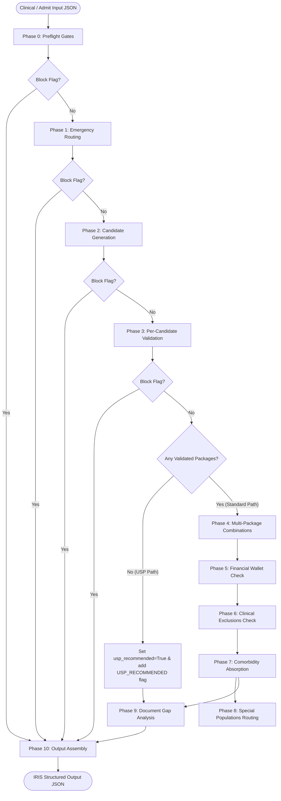

# IRIS Pre-Auth & Claim Selection Engine — System Design

This document serves as the absolute, ground-up source of truth for the architecture, data models, knowledge base schemas, processing pipeline, and LLM integrations of the IRIS pre-authorisation and claim selection engine. All descriptions correspond directly to the actual python codebase.

---

## 1. Pipeline Architecture & Overview

The IRIS pipeline is built around a shared, mutable state container: the `IRISSession`. The system processes patient clinical cases in two major stages: **Stage 1 & 2 (Pre-Authorisation)** and **Stage 3 (Claims Verification)**.

### Stage 1 & 2: Pre-Authorisation Pipeline (Phases 0–10)

The pre-authorisation workflow runs sequentially through 11 phases (Phases 0 through 10). Each phase mutates the `IRISSession` by adding flags, errors, or calculating package fields.

#### Pipeline Sequence and State Mutations

| Phase | Name | Reads from Session / Input | Writes to Session |
| :--- | :--- | :--- | :--- |
| **Phase 0** | **Preflight Gates** | `input_data["patient"]["patient_id"]`, `input_data["hospital"]["hospital_id"]`, `clinical.is_medico_legal` | `patient` (`PatientContext`), `hospital` (`HospitalContext`), `patient_eligible`, `hospital_empanelled`, `mlc_required` |
| **Phase 1** | **Emergency Routing** | `clinical` (vitals, chief complaints) | `is_emergency` (always `False`), `er_package_code` (always `None`), `needs_specialty_package` (always `True`) |
| **Phase 2** | **Candidate Generation** | `clinical`, `hospital.empanelled_specialties`, `hospital.type` | `candidate_packages` (`list[CandidatePackage]`) |
| **Phase 3** | **Per-Candidate Validation** | `candidate_packages`, `clinical`, `hospital`, `patient` | `validated_packages` (`list[ValidatedPackage]`), `phase3_blocked` (`list[dict]`), `stg_coverage` (`dict`) |
| **Phase 4** | **Multi-Package Combinations** | `validated_packages`, `clinical` | `final_package_set` (`list[FinalPackage]`) |
| **Phase 5** | **Financial Wallet Check** | `final_package_set`, `patient` | `estimated_total_inr`, `wallet_sufficient`, `copayment_required`, `copayment_gap_inr` |
| **Phase 6** | **Clinical Exclusions Check** | `final_package_set`, `patient.age`, `clinical` | Mutates `final_package_set` (drops excluded packages) |
| **Phase 7** | **Comorbidity Absorption** | `clinical.comorbidities`, `final_package_set` | `comorbidity_notes` (`list[str]`) |
| **Phase 8** | **Special Populations Routing**| `patient`, `final_package_set`, `hospital` | Appends advisory flags |
| **Phase 9** | **Document Gap Analysis** | `final_package_set`, `clinical`, `hospital`, `mlc_required`, `flags` | `preauth_docs_required`, `preauth_docs_missing`, `query_predictions` (`list[PackageQueryPrediction]`) |
| **Phase 10**| **Output Assembly** | All accumulated session state (Read-Only) | Does not write back; returns `IRISOutput` |

#### Early Exits and Routing Pathways



1. **Early Exit (Block Flag Check):** After Phase 0, Phase 1, Phase 2, and Phase 3, the orchestrator checks `session.has_block_flag()`. If any flag with `severity == "block"` is present, the pipeline immediately halts execution, skips all remaining phases, and jumps to Phase 10 (Output Assembly) to return a `BLOCKED` status.
2. **Unspecified Surgical Package (USP) Pathway:** After Phase 3, if `session.validated_packages` is empty (meaning no candidate package passed clinical validation/STG gates), the orchestrator initiates the USP pathway:
   - `session.usp_recommended` is set to `True`.
   - The warning flag `USP_RECOMMENDED` is added to the session.
   - Phases 4 through 8 are completely bypassed.
   - The pipeline executes Phase 9 (Document Gap Analysis) and Phase 10 (Output Assembly) directly.

---

### Stage 3: Claims Verification Pipeline (Phase 11)

Implemented in `phases/phase11_claim.py` and run via `main_claim.py`, the claims verification pipeline implements a 13-step verification process to compare actual discharge data against the approved pre-authorization baseline:

*   **Step 0: Cross-consistency checking:** Validates identity mismatch checks (patient PMJAY ID, admitting hospital, treating doctor registration number) and package integrity (comparing pre-auth validated `procedure_code` against discharge `admission.package_booked`). Also performs an LLM-based clinical consistency check to alert on diagnosis or admission type inconsistencies (e.g. elective pre-auth vs. emergency discharge).
*   **Step 1: Claim context loading:** Reads the pre-auth output dict, checks for selected packages, and pulls active STG details and specialty HBP shards.
*   **Step 2: Discharge summary completeness check:** Evaluates the discharge summary against CAM Annexure 6 criteria for fields (patient/hospital identifiers, treating consultant, diagnosis, procedure, treatment details) and signatures (consultant, PMAM, patient/attendant).
*   **Step 3: Required claim documents list building:** Compiles mandatory documents from STGs, HBP shards (as fallback if STG is missing), implant invoices (if required), and mortality audit reports (if death occurs within 24 hours). Resolves duplicate documents using a bidirectional alias-to-canonical checks dictionary (`EQUIVALENT_KEYS`).
*   **Step 4: Length of Stay (LoS) check:** Computes actual LoS vs. indicative LoS. Checks if an approved enhancement plan was filed for prolonged stays.
*   **Step 5: Deviation detection:** Flags anomalies including procedure code changes, ward category upgrades/downgrades, doctor registration mismatches, LoS excesses with no enhancement, and urology minor procedure sub-inclusions.
*   **Step 6: LLM Evaluation (CPD Checker):** Calls Gemini to evaluate actual findings against the CPD claim checklist and drafts clinical justifications for any detected deviations.
*   **Step 7: Special payments calculation:** Applies partial billing calculations for LAMA/DAMA, death (on-table, within 24h, or post-operative), and referral cases based on per-day bed category rates and HBP guidelines.
*   **Step 8: Audit flag triggering:** Triggers flags for stable-in-ICU, prolonged stay, billed days exceeding stay, missing STG documents, unspecified package abuse, and patient cash collection.
*   **Step 9: SHA notification date check:** Verifies if the hospital notified the State Health Authority within 24 hours of LAMA, referral, or death.
*   **Step 10: Specialty guidelines check:** Applies rules like BM (Burns management) follow-up photo frequency (days 5, 10, 15, 20) and MC/SV (Cardiology) stent carton sticker verification.
*   **Step 11: Claim status mapping:** Assigns the final claim routing state (`CLAIM_BLOCKED`, `CLAIM_DEVIATION`, `CLAIM_GAPS`, or `CLAIM_READY`).
*   **Step 12: Final Assembly:** Packs findings and returns `IRISClaimOutput`.

---

## 2. File Structure & Module Purposes

```
e:\Code\1hat-phase1\
│
├── config.py                     # Global constants, paths, thresholds, and search mode
├── logger_setup.py               # Standardized stdout console logging utility
├── input_validator.py            # Input JSON schema validation rules (stub returning True)
├── models.py                     # Unified data models and dataclass definitions
├── session.py                    # Session state class (IRISSession) for pipeline execution
├── main.py                       # Pre-authorisation pipeline entry point and orchestrator
├── main_claim.py                 # Claims verification pipeline entry point and orchestrator
├── app.py                        # Streamlit web dashboard with Tab 1 (Pre-auth), Tab 2 (Claims), Tab 3 (About)
├── eval.py                       # Subprocess test suite running inputs against expected_output.json
│
├── kb/
│   ├── __init__.py               # Package marker
│   ├── loader.py                 # Shard-level JSON file loaders and caches (using @lru_cache)
│   ├── searcher.py               # Fuzzy candidate selection using RapidFuzz token_set_ratio
│   ├── searcher_llm.py           # Gemini-based candidate selection
│   └── searcher_router.py        # Routes search queries to fuzzy or llm backend based on config
│
├── llm/
│   ├── __init__.py               # Package marker
│   ├── conflict_resolver.py      # LLM check for mutual exclusions and sub-inclusions in Phase 4
│   ├── cpd_evaluator.py          # LLM evaluation of CPD checklists and deviation justifications
│   ├── nearest_match.py          # LLM identification of closest blocked candidate post-failure
│   ├── query_predictor.py        # LLM query predictor checking qualification, vitals, and STGs
│   └── stg_checker.py            # LLM check for STG criteria, plausibility, and stratum ties
│
├── phases/
│   ├── __init__.py               # Package marker
│   ├── phase0_preflight.py       # Patient eligibility (BIS) and hospital check (HEM)
│   ├── phase1_emergency.py       # Emergency package check (stubbed for elective cases)
│   ├── phase2_candidates.py      # Candidate generation orchestration
│   ├── phase3_validator.py       # Validation logic: rules, STGs, implants, and tiebreakers
│   ├── phase4_multipackage.py    # PM-JAY package combinations and sliding-scale deductions
│   ├── phase5_financial.py       # Wallet balance sufficiency check and Vay Vandana allocation
│   ├── phase6_exclusion.py       # Keyword screen and LLM exception engine for exclusions
│   ├── phase7_comorbidity.py     # Management conditions comorbidity absorption
│   ├── phase8_special_pop.py     # Specialty advisory routing (neonatal, oncology, transplant, etc.)
│   ├── phase9_documents.py       # Document checklist compilation and gap checker
│   ├── phase10_output.py         # Readiness status calculation and output serialization
│   └── phase11_claim.py          # Claims verification logic (13-step verification)
│
├── stubs/
│   ├── __init__.py               # Package marker
│   ├── bis_stub.py               # Mock client reading dummy_bis.json for patient details
│   └── hem_stub.py               # Mock hospital empanelment stub reading dummy_hem.json
│
├── intake/
│   ├── __init__.py               # Package marker
│   ├── intake_runner.py          # Folder scanning, text extraction, parser orchestration, schema validation
│   ├── pdf_extractor.py          # Text extraction from PDF using pdfplumber, falling back to Tesseract OCR
│   ├── docx_extractor.py         # Text extraction from DOCX paragraphs and tables using python-docx
│   ├── discharge_parser.py       # Gemini-based unstructured medical text to schema mapping parser
│   └── schema_validator.py       # Enforces hard-required patient, admission, and clinical fields
│
└── data/
    ├── KB_SPEC.md                # Specifications for knowledge base structures
    ├── dummy/
    │   ├── dummy_bis.json        # Mock patient database (identities, wallets, and past claims)
    │   └── dummy_hem.json        # Mock hospital database (empanelments and specialties)
    ├── schemes/
    │   └── pmjay.json            # PM-JAY core configuration master (KB-1)
    ├── hbp/
    │   ├── _index.json           # Flat index of all procedure codes across specialties (KB-2)
    │   └── <specialty>.json      # Category package master shards (KB-2)
    ├── stg/
    │   └── <procedure_code>.json # Standard Treatment Guideline json files (KB-3)
    └── samples/
        └── query_taxonomy.json   # Standardized query and rejection taxonomy placeholder (KB-4)
```

---

## 3. Data Models (`models.py`)

IRIS defines the following dataclasses to represent structures throughout the pipelines:

### 1. `WalletBalance`
Represents the patient's remaining wallet balances under the scheme.
*   `family_balance_inr: int` — Primary family entitlement balance (₹5 lakh/year standard).
*   `vay_vandana_balance_inr: int | None` — Additional Vay Vandana Yojana entitlement for senior citizens (age ≥70).
*   `policy_year_start: str` — ISO date string marking the start of the active policy year.

### 2. `PastClaim`
A single historical PM-JAY claim record for the beneficiary.
*   `procedure_code: str` — Historical procedure code.
*   `admission_date: str` — ISO date string of admission.
*   `package_amount_inr: int` — Billed amount of the package.
*   `status: str` — "approved" | "rejected" | "pending".

### 3. `PatientContext`
Beneficiary identity and entitlement data loaded by Phase 0.
*   `patient_id: str` — Unique patient ID.
*   `family_id: str` — Unique family ID.
*   `name: str` — Patient's full name.
*   `age: int` — Patient's age in years.
*   `gender: str` — "M" | "F".
*   `home_state: str` — Patient's state of residence.
*   `home_district: str` — Patient's district of residence.
*   `wallet: WalletBalance` — Current wallet balances.
*   `past_claims: list[PastClaim]` — Past claims history.

### 4. `HospitalContext`
Empanelled hospital profile loaded by Phase 0.
*   `hospital_id: str` — Unique hospital ID.
*   `name: str` — Hospital's name.
*   `type: str` — "private" | "public".
*   `city_tier: str` — "tier1" | "tier2" | "tier3".
*   `state: str` — State where hospital is located.
*   `district: str` — District where hospital is located.
*   `is_aspirational_district: bool` — True if located in an aspirational district.
*   `accreditation: str` — "none" | "bronze" | "nabh_entry" | "nabh_full" | "nqas".
*   `scheme: str` — Must be "pmjay" for MVP.
*   `empanelled_specialties: list[str]` — Empanelled 2-letter specialty codes.

### 5. `StructuredValue`
A single extracted parameter from an OCR-processed investigation document.
*   `parameter: str` — Parameter name (e.g. "Troponin I", "Hemoglobin").
*   `value: float | str | None` — Numeric value or qualitative result.
*   `unit: str | None` — Unit of measurement.
*   `flag: str | None` — "H" (high) | "L" (low) | "N" (normal) | None.
*   `leads: str | None` — ECG-specific field identifying leads.

### 6. `Investigation`
A single investigation or diagnostic report in the clinical input.
*   `type: str` — canonical type (e.g., "ecg", "echo", "ct", "blood_reports").
*   `result_summary: str | None` — Free-text summary of the report.
*   `structured_values: list[StructuredValue] | None` — Machine-readable parameters.
*   `document_available: bool` — Whether the document is in hand.
*   `report_date: str | None` — ISO report date.

### 7. `DocumentInHand`
A non-clinical document collected from the patient at admission.
*   `key: str` — Canonical document key (e.g., "patient_photo", "clinical_notes").
*   `label: str` — Human-readable document name.
*   `available: bool` — True if the document is available.

### 8. `ExaminationFindings`
Structured systemic examination findings recorded at admission.
*   `general: str | None` — General findings.
*   `cvs: str | None` — Cardiovascular findings.
*   `rs: str | None` — Respiratory findings.
*   `abdomen: str | None` — Abdomen examination details.
*   `cns: str | None` — Central Nervous System findings.
*   `local: str | None` — Local examination details.

### 9. `PersonalHistory`
Patient personal/social history relevant to clinical context.
*   `smoking: str | None` — Smoking history details.
*   `alcohol: str | None` — Alcohol history details.
*   `diet: str | None` — Diet details.

### 10. `TreatingDoctor`
Identity and qualification of the admitting/treating doctor.
*   `name: str` — Doctor's name.
*   `registration_number: str` — Medical Council registration number.
*   `qualification: str` — Academic degree string (e.g., "MD DM Cardiology").
*   `specialty_code: str` — 2-letter HBP specialty code.

### 11. `ClinicalInput`
Complete clinical presentation of the patient at admission.
*   `admission_date: str | None` — ISO admission date.
*   `bed_category: str | None` — ward | hdu | icu_no_vent | icu_vent | None.
*   `is_emergency: bool` — True if admitted as emergency.
*   `is_medico_legal: bool` — True if MLC.
*   `chief_complaints: str` — Free-text chief complaints.
*   `duration_days: int` — Duration of complaints.
*   `history_of_present_illness: str | None` — Present illness history.
*   `provisional_diagnosis: str` — Provisional diagnosis.
*   `planned_procedure: str | None` — Planned procedure description.
*   `weight_kg: float | None` — Weight in kilograms.
*   `height_cm: float | None` — Height in centimeters.
*   `vitals: dict` — Dictionary of vital parameters.
*   `examination_findings: ExaminationFindings | None` — Examination findings.
*   `investigations: list[Investigation]` — Diagnostics list.
*   `comorbidities: list[str]` — Comorbidity list.
*   `past_medical_history: str | None` — Past medical history.
*   `past_surgical_history: str | None` — Past surgical history.
*   `current_medications: list[str]` — List of medications.
*   `allergies: list[str]` — List of allergies.
*   `personal_history: PersonalHistory | None` — Personal history details.
*   `family_history: str | None` — Family history details.
*   `non_clinical_documents_in_hand: list[DocumentInHand]` — Documents in hand.
*   `treating_doctor: TreatingDoctor | None` — Admitting doctor's details.
*   `notes: str | None` — Optional notes.

### 12. `CandidatePackage`
Thin procedure record produced by Phase 2 search against `_index.json`.
*   `procedure_code: str` — Standard PM-JAY procedure code.
*   `package_code: str` — Parent package code.
*   `specialty_code: str` — specialty identifier.
*   `specialty: str` — specialty name.
*   `package_name: str` — Package name.
*   `procedure_name: str` — Procedure name.
*   `billing_unit: str` — billing unit type.
*   `reserved_public_only: bool` — Public-reserved status.
*   `procedure_label: str` — regular | add_on | standalone | follow_up.
*   `auto_approved: str` — none | full | day1_only.
*   `day_care: bool` — True if daycare procedure.
*   `base_rate_inr: int | None` — Base rate.
*   `match_score: float` — String similarity score.

### 13. `StratificationResult`
Outcome of Phase 3 stratification matching for a single procedure.
*   `determinable: bool` — True if stratification variables are resolved.
*   `selected_stratum: str | None` — Strata selected.
*   `note: str | None` — Detailed reason if not determinable.

### 14. `ImplantResult`
Implant applicability determination for a single procedure.
*   `required: bool` — True if procedure requires an implant.
*   `name: str | None` — Name of the implant.
*   `cost_inr: int | None` — Standard implant rate.
*   `age_appropriate: bool` — True if age matching succeeded.
*   `gender_appropriate: bool` — True if gender matching succeeded.
*   `quantity: int | None` — Required implant quantity.

### 15. `ValidatedPackage`
Rich procedure record produced by Phase 3 after full validation.
*   Includes all fields of `CandidatePackage` plus:
*   `billing_type: str` — surgical | fixed_medical | per_day | day_care.
*   `enhancement_applicable: bool` — Enhancement suitability flag.
*   `enhancement_requests_needed: int | None` — Estimated number of enhancement requests.
*   `stratification: StratificationResult` — Selected stratification details.
*   `implant: ImplantResult` — Implant results.
*   `special_conditions_popup: bool` — True if special popup conditions apply.
*   `special_conditions_rule: bool` — True if special rules apply.
*   `stg_eligible: bool` — True if patient meets STG rules.
*   `stg_missing_criteria: list[str]` — List of missing criteria.
*   `stg_reasoning: str | None` — Explanation summary.
*   `is_addon_to: list[str] | None` — Potential parent procedure list.
*   `addon_type: str | None` — Type of add-on.
*   `flags: list[str]` — Warning flags accumulated for this package.

### 16. `FinalPackage`
A validated package after Phase 4 combination rule processing.
*   `validated: ValidatedPackage` — Wrapped validated package.
*   `role: str` — primary | secondary | tertiary | addon | standalone.
*   `deduction_factor: float` — Rate multiplier (1.0 | 0.5 | 0.25).
*   `pre_auth_group: int` — 1 = main pre-auth, 2 = standalone/split.

### 17. `DocumentItem`
A single document entry in the pre-auth document checklist (Phase 9).
*   `key: str` — Document code identifier.
*   `label: str` — Document name.
*   `package_code: str | None` — Package code target (None if universal).
*   `available: bool` — True if available.
*   `criticality: str` — hard_block | ppd_query_risk.

### 18. `Flag`
A pipeline business event flag appended to `session.flags` during execution.
*   `code: str` — UPPER_SNAKE_CASE identifier.
*   `message: str` — Descriptive message.
*   `severity: str` — info | warning | block.

### 19. `EnhancementPlan`
Pre-computed enhancement request estimate for a single per_day procedure.
*   `procedure_code: str` — Target procedure code.
*   `estimated_requests: int` — Projected enhancement count.
*   `batch_size_used: int` — Batch size parameter applied.
*   `los_indicative_days: int` — Indicative LoS in days.
*   `caveat: str` — Legal disclaimer.

### 20. `ChecklistItemResult`
*   `question: str` — Checklist question.
*   `expected: bool` — Expected boolean answer.
*   `actual: bool | None` — Actual matched boolean value.
*   `risk_level: str` — low | medium | high.
*   `reasoning: str` — Reason notes.

### 21. `CommonQueryRisk`
*   `query_text: str` — Standard query text.
*   `risk_level: str` — low | medium | high.
*   `reasoning: str` — Reasoning details.

### 22. `PackageQueryPrediction`
*   `procedure_code: str` — Procedure code.
*   `package_name: str` — Specialty package name.
*   `readiness_verdict: str` — Verdict rating.
*   `verdict_summary: str` — Short text summary.
*   `checklist_results: list[ChecklistItemResult]` — Checklist validations.
*   `common_query_risks: list[CommonQueryRisk]` — General query risks.
*   `advisory_claim_docs: list[dict]` — Advisory document guidance.
*   `llm_evaluation_status: str` — LLM status tracker.

### 23. `ClaimDocumentItem`
*   `key: str` — Document code.
*   `label: str` — Document label.
*   `package_code: str | None` — Package reference.
*   `available: bool` — Status checker.
*   `criticality: str` — hard_block | warning | info.
*   `notes: str | None` — Notes.

### 24. `DeviationItem`
*   `deviation_type: str` — Type of deviation.
*   `description: str` — Description details.
*   `from_value: str` — Baseline value.
*   `to_value: str` — Discharge value.
*   `severity: str` — warning | info.
*   `justification_draft: str | None` — Auto-generated justification draft.
*   `justification_required: bool` — True if justification is needed.

### 25. `CPDChecklistResult`
*   `question: str` — Question.
*   `expected: bool` — Expected boolean.
*   `actual: bool | None` — Actual boolean value.
*   `risk_level: str` — Risk level rating.
*   `reasoning: str` — Reason notes.

### 26. `SpecialPaymentResult`
*   `trigger: str` — Partial billing trigger (e.g. LAMA, death, referral).
*   `base_package_rate_inr: int` — Original base package rate.
*   `payable_amount_inr: int` — Calculated payout amount.
*   `payable_percentage: int` — Payout percentage of the package.
*   `computation_note: str` — Math breakdown.

### 27. `IRISClaimOutput`
Output container of the Stage 3 claims pipeline. Holds checklists, deviations, justifications, and partial payment details.

### 28. `IRISOutput`
Final output container of the Stage 1 & 2 pre-auth pipeline. Holds selection, blocked lists, checklists, query predictions, and status.

---

## 4. Knowledge Base (KB) Architecture

IRIS partitions references and catalog data into 5 separate tiers:

*   **KB-1: Core Scheme Rules**
    *   *Source file:* `data/schemes/pmjay.json`
    *   *Purpose:* Declares scheme pricing configurations, Northeast states, private/public enhancement batch limits, bed category multipliers, LAMA/DAMA partial billing percentages, and discharge audit triggers.
    *   *Status:* **Active**.
*   **KB-2: Specialty Shards & Derived Index**
    *   *Source files:* `data/hbp/` directory.
    *   *Purpose:* Houses specialty shards (e.g., `cardiology.json`, `general_surgery.json`) containing full procedure records (billing_unit, reserved_public_only, stratification, is_addon_to, implant, rates_inr, pricing details) and a compiled `_index.json` containing flat metadata for searching.
    *   *Status:* **Active**.
*   **KB-3: Standard Treatment Guidelines**
    *   *Source files:* `data/stg/<procedure_code>.json`
    *   *Purpose:* Standard Treatment Guidelines for specific procedures. Declares clinical indications, structured clinical thresholds (parameter, operator, value), doctor qualification checks, checklist queries, common auditor queries, and pre-auth/claim document lists.
    *   *Status:* **Active**.
*   **KB-4: Rejection & Query Taxonomy**
    *   *Source file:* `data/query_taxonomy.json` (Falls back to `data/samples/query_taxonomy.json` if absent).
    *   *Purpose:* Master taxonomy catalog mapping rejection codes and claim audit red flags.
    *   *Status:* **Missing** (Loads the samples fallback).
*   **KB-5: State-Specific Overrides**
    *   *Source file:* `data/schemes/cmchis.json`.
    *   *Purpose:* State-specific override sheets (e.g., CMCHIS Tamil Nadu).
    *   *Status:* **Not Started** (Stubbed or not implemented).

---

## 5. LLM Integration Policy

IRIS integrates Large Language Models (LLMs) selectively for clinical reasoning. The system runs a **fail-open** policy: if any LLM call fails due to API limits or timeouts, the engine registers a warning flag and degrades to a safe, deterministic default.

*   **Model:** `gemini-2.5-flash`
*   **Temperature:** `0` (enforces strict determinism and consistency across runs)
*   **Timeouts:** Standard Calls: `30` seconds | Query Predictor / CPD Evaluator: `90` seconds
*   **Retries:** `2` attempts for all calls

### Primary LLM Functions and Fallbacks

| LLM Function | Trigger | Task | Fallback |
| :--- | :--- | :--- | :--- |
| **`search_candidates`** | Phase 2 candidate search (LLM mode) | Map clinical text to procedure code candidates | Returns `[]` or falls back to fuzzy matching |
| **`check_stg_eligible`** | Phase 3 STG validation (STG JSON present) | Check if clinical text satisfies STG criteria | Returns `eligible = True` with low confidence |
| **`check_plausibility`** | Phase 3 STG validation (STG JSON missing) | Clinical plausibility check of procedure code | Returns `plausible = True` with warning flag |
| **`resolve_stratum`** | Phase 3 stratification tiebreaker | Select best-fitting stratum variant | Selects highest fuzzy match candidate |
| **`resolve_conflicts`** | Phase 4 combination check | Detect mutual exclusions or sub-inclusions | Retains all validated candidates |
| **`_check_exclusion_with_llm`** | Phase 6 exclusions evaluation | Evaluate Annexure 5 exceptions (dental, cosmetic, rehab) | Retains package and adds manual audit flag |
| **`predict_package_queries`** | Phase 9 query prediction | Assesses qualification tokens, vitals, and STG gaps | Returns `ready` / `unknown` status |
| **`get_nearest_match`** | Orchestrator (if all candidates blocked) | Identifies nearest matching code and main deficit | Returns `None` |
| **`evaluate_claim_with_cpd`** | Phase 11 claims checklist check | Audit discharge data and draft deviation justifications | Returns empty checklists with status `failed` |
| **`check_clinical_consistency`** | Phase 11 claims Step 0 check | Match pre-auth diagnosis against discharge summary | Returns empty list `[]` of consistency issues |

---

## 6. Business Flags & Reason Codes

IRIS records pipeline events as **Business Flags** (user-facing, session-level) or **Reason Codes** (reasons why candidate packages were rejected in Phase 3).

### Business Flag Codes

| Flag Code | Severity | Source Phase | Description / Trigger |
| :--- | :--- | :--- | :--- |
| **`PREFLIGHT_FAILED`** | `block` | Phase 0 | Exception during BIS or HEM stub check |
| **`PATIENT_NOT_IN_BIS`** | `block` | Phase 0 | Patient ID is not present in BIS database |
| **`SCHEME_NOT_SUPPORTED`** | `block` | Phase 0 | Admitting hospital scheme is not `"pmjay"` |
| **`EMERGENCY_PHASE_STUBBED`** | `info` | Phase 1 | Informational flag indicating emergency routing is stubbed |
| **`CANDIDATES_GENERATED`** | `info` | Phase 2 | Shortlist generated from catalog index |
| **`NO_CANDIDATES_FOUND`** | `warning` | Phase 2 | Fuzzy or LLM search yielded zero matching candidates |
| **`CANDIDATE_GENERATION_FAILED`** | `block` | Phase 2 | Exception caught during candidate search |
| **`NO_VALIDATED_PACKAGES`** | `warning` | Phase 3 | All candidate packages were blocked in validation |
| **`USP_RECOMMENDED`** | `warning` | `main.py` | USP referral pathway recommended |
| **`CONFLICT_RESOLVED`** | `info` | Phase 4 | Conflicting package(s) dropped by LLM Conflict Resolver |
| **`SURGICAL_PERDAY_BLOCKED`** | `warning` | Phase 4 | Medical per-day package dropped due to surgical presence |
| **`PERDAY_MULTIPLE_BLOCKED`** | `warning` | Phase 4 | Extra medical per-day package dropped (only 1 allowed) |
| **`STANDALONE_SPLIT`** | `info` | Phase 4 | Standalone packages split into `pre_auth_group=2` |
| **`ADDON_PARENT_UNKNOWN`** | `warning` | Phase 4 | Dropped add-on package lacking parent mappings |
| **`ADDON_PARENT_MISSING`** | `warning` | Phase 4 | Dropped add-on because parents are absent in selection set |
| **`DIAGNOSTIC_ADDON_BLOCKED`** | `warning` | Phase 4 | Dropped high-end diagnostic add-on due to missing per-day primary |
| **`DEDUCTION_APPROXIMATE`** | `info` | Phase 4 | Deduction ordering uses base rate as proxy for final rates |
| **`RATE_NULL_FOR_PERDAY`** | `info` | Phase 5 | Excluded per-day packages lacking rates from cost estimate |
| **`VAY_VANDANA_DEBIT_ORDER_AMBIGUOUS`** | `warning` | Phase 5 | Dual-wallet senior citizen; debit order requires clarification |
| **`WALLET_INSUFFICIENT`** | `warning` | Phase 5 | Total package cost exceeds available balance |
| **`FINANCIAL_ESTIMATE_APPROXIMATE`**| `info` | Phase 5 | Financial estimate excludes HBP modifiers |
| **`EXCLUSION_<CAT>_RISK`** | `warning` | Phase 6 | Keywords trigger risk of specific exclusion category |
| **`EXCLUSION_<CAT>_RISK_BLOCKED`**| `block` | Phase 6 | Group A exclusion verified with no exceptions; package dropped |
| **`COMORBIDITY_REVIEW_NEEDED`** | `info` | Phase 7 | Non-standard comorbidity found; needs manual review |
| **`NEONATAL_ESCALATION_RISK`** | `warning` | Phase 8 | Neonatal patient (age 0); monitoring required |
| **`PAEDIATRIC_DEVICE`** | `info` | Phase 8 | Paediatric patient (age ≤ 14); pediatric sizing applies |
| **`MTB_REQUIRED`** | `warning` | Phase 8 | Oncology procedure; requires Tumour Board approval |
| **`ONCOLOGY_MULTI_STAGE`** | `info` | Phase 8 | Oncology patient; current stage evaluated only |
| **`PORTABILITY_CASE`** | `info` | Phase 8 | Portability alert; longer TAT applies |
| **`NOTTO_DOCS_REQUIRED`** | `warning` | Phase 8 | Transplant procedure; NOTTO IDs required |
| **`DOC_GAP_ANALYSIS`** | `info` | Phase 9 | Informational checklist execution details |
| **`MANDATORY_DOCS_MISSING`** | `warning` | Phase 9 | One or more hard-block documents are missing |
| **`IDENTITY_MISMATCH_PMJAY_ID`** | `block` | Phase 11 | PMJAY ID mismatch between pre-auth approved baseline and discharge JSON |
| **`IDENTITY_MISMATCH_HOSPITAL`** | `block` | Phase 11 | Hospital code mismatch between pre-auth approved baseline and discharge JSON |
| **`IDENTITY_MISMATCH_DOCTOR_REG`** | `block` | Phase 11 | Doctor medical registration mismatch between pre-auth approved baseline and discharge JSON |
| **`PROCEDURE_MISMATCH`** | `block` | Phase 11 | Pre-auth approved procedure code differs from actual discharge procedure code |
| **`CLINICAL_CONSISTENCY_WARNING`** | `warning` | Phase 11 | Diagnosis, admission type or related clinical parameters are inconsistent |

### Blocked Candidate Reason Codes

These reasons are written to `session.phase3_blocked` under the `reason_code` key:

*   **`SPECIALTY_CODE_UNKNOWN`**: Candidate specialty code has no shard mapping.
*   **`SHARD_NOT_FOUND`**: HBP specialty shard JSON file not found in `data/hbp/`.
*   **`PROCEDURE_NOT_IN_SHARD`**: Procedure code not present in specialty HBP shard.
*   **`PUB_RESERVED_BLOCK`**: Public-only reserved package booked by a private hospital.
*   **`STG_REQUIRED`**: STG file missing when `REQUIRE_STG_FOR_VALIDATION` is `True`.
*   **`PLAUSIBILITY_FAILED`**: Failed LLM clinical plausibility check.
*   **`STG_NOT_ELIGIBLE`**: Guidelines specified in the STG JSON were not met.
*   **`STRATUM_NOT_SELECTED`**: Duplicate package variant dropped by stratum tiebreaker.
*   **`INTERNAL_ERROR`**: Unhandled exception caught during candidate validation.

---

## 7. Configuration Parameters (`config.py`)

All variables in `config.py` control the engine's core parameters:

*   **`PROJECT_ROOT` / `DATA_DIR` / `HBP_DIR` / `STG_DIR` / `SCHEMES_DIR` / `DUMMY_DIR`**: Path objects pointing to package masters, STGs, and dummy databases.
*   **`INDEX_FILE`**: Pointer to the flat HBP specialty index file (`data/hbp/_index.json`).
*   **`PMJAY_RULES_FILE`**: Core scheme master path (`data/schemes/pmjay.json`).
*   **`QUERY_TAXONOMY_FILE`**: Rejection taxonomy path (`data/query_taxonomy.json`).
*   **`DUMMY_BIS_FILE` / `DUMMY_HEM_FILE`**: Mock data pointers for BIS and HEM databases.
*   **`TOP_N_CANDIDATES`** (`30`): Maximum number of search candidates passed to Phase 3.
*   **`MIN_FUZZY_SCORE`** (`50`): Minimum RapidFuzz match score to retain a candidate.
*   **`ENHANCEMENT_BATCH_PRIVATE`** (`2`): Extension batch size (days) for private hospitals.
*   **`ENHANCEMENT_BATCH_PUBLIC`** (`5`): Extension batch size (days) for public or NE-region hospitals.
*   **`NE_STATES_AND_ISLANDS`**: Regions qualifying for the public-tier enhancement batch size.
*   **`REQUIRE_STG_FOR_VALIDATION`** (`False`): If `True`, missing STGs block candidates; if `False`, falls back to clinical plausibility check.
*   **`LLM_MODEL`** (`"gemini-2.5-flash"`): Gemini model ID used for all pipeline reasoning.
*   **`LLM_TIMEOUT_SECONDS`** (`30`): Timeout for standard LLM calls.
*   **`QUERY_PREDICTOR_TIMEOUT_SECONDS`** (`90`): Timeout for query predictor / CPD evaluator calls.
*   **`LLM_MAX_RETRIES`** (`2`): Retry limit for transient LLM API issues.
*   **`SENIOR_CITIZEN_AGE`** (`70`): Age threshold triggering Vay Vandana wallet balance rules.
*   **`PAEDIATRIC_AGE_MAX`** (`14`): Age limit for pediatric implant guidelines.
*   **`FAMILY_WALLET_DEFAULT_INR`** (`500000`): Default family wallet limit.
*   **`VAY_VANDANA_WALLET_INR`** (`500000`): Senior citizen top-up limit.
*   **`LOG_LEVEL`** (`"INFO"`) & **`LOG_FORMAT`**: Python logging configurations.
*   **`PHASE2_SEARCH_MODE`** (`"llm"`): Switch between `"fuzzy"` (RapidFuzz) and `"llm"` (Gemini search).

---

## 8. Known Gaps & Stubs

The following segments are stubbed, missing database mappings, or have placeholder implementations:

1.  **Phase 1 (Emergency Routing):** Completely stubbed. Always assumes planned elective admissions (`is_emergency = False`, `needs_specialty_package = True`).
2.  **KB-4 (Query / Rejection Taxonomy):** The production `data/query_taxonomy.json` file is missing. The loader falls back to `data/samples/query_taxonomy.json`.
3.  **KB-5 (State Overrides CMCHIS):** Tamil Nadu state overrides (`cmchis.json`) are not started.
4.  **Phase 4 Deduction Factors Ordering:** Ordering is based on base rates. PM-JAY combination rules require ordering by final calculated rates (multipliers are only resolved in Phase 5).
5.  **Phase 8 Paediatric Device Limits:** Sizing checks are advisory alerts; they do not perform physical range validations on implants.
6.  **LoS Persistence in EnhancementPlan:** `ValidatedPackage` does not persist the raw `los_indicative` integer used during Phase 3. The `los_indicative_days` field in `EnhancementPlan` is returned as a placeholder `0`.
7.  **HEM stub empanelment:** HEM stub in Phase 0 assumes all queried hospitals are empanelled.
8.  **Input Validator (`input_validator.py`):** Structured validation is stubbed; always returns `(True, [])`.
